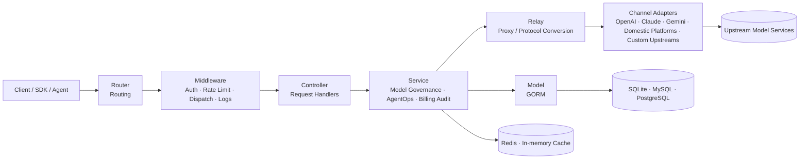

<div align="center">


# MAX API

🍥 **AI Model Governance, AgentOps, and AGI Application Service Infrastructure**

<p align="center">
  <a href="./README.zh_CN.md">简体中文</a> |
  <a href="./README.zh_TW.md">繁體中文</a> |
  <strong>English</strong> |
  <a href="./README.fr.md">Français</a> |
  <a href="./README.ja.md">日本語</a>
</p>

<p align="center">
  <a href="https://raw.githubusercontent.com/MAX-API-Next/MAX-API/main/LICENSE">
    
  </a><!--
  --><a href="https://github.com/MAX-API-Next/MAX-API/releases/latest">
    
  </a><!--
  --><a href="https://hub.docker.com/r/cscitechtop/max-api">
    
  </a><!--
  --><a href="https://goreportcard.com/report/github.com/MAX-API-Next/MAX-API">
    
  </a>
</p>

<p align="center">
  <a href="#-project-positioning">Positioning</a> •
  <a href="#-release-channels">Release Channels</a> •
  <a href="#-governance-framework">Governance</a> •
  <a href="#-use-cases">Use Cases</a> •
  <a href="#-quick-start">Quick Start</a> •
  <a href="#-key-capabilities">Capabilities</a> •
  <a href="#-governance-configuration">Configuration</a> •
  <a href="#-architecture-overview">Architecture</a> •
  <a href="#-ai-model-and-interface-support">Models & APIs</a> •
  <a href="#-deployment">Deployment</a> •
  <a href="#-faq">FAQ</a> •
  <a href="#-license">License</a>
</p>

</div>

---

## 📝 Project Description

MAX API is an AI model governance, AgentOps, and application service infrastructure project initiated, maintained, and operated long term by AGI enthusiasts from research institutions and universities. It provides developers, researchers, teams, and organizations with a stable and reusable service layer. The project focuses on the operational problems that appear after AI applications move into real use: more models, frequent upstream API changes, longer Agent call chains, and rising pressure around cost and auditability. MAX API provides a unified access, authentication, routing, billing, observability, and governance layer between applications, Agents, users, organizations, and upstream model providers, helping AI applications run with greater stability and control.

Ongoing investment areas:

- **AI model governance**: continuously tracks model updates, API changes, parameter differences, pricing rules, and task protocols across OpenAI, Azure OpenAI, AWS Bedrock, Vertex AI, Ollama, and domestic platforms such as DeepSeek, Qwen / Alibaba Cloud Model Studio, Zhipu GLM, Kimi, Doubao / Volcano Engine, Tencent Hunyuan, Baidu ERNIE / Qianfan, iFlytek Spark, MiniMax, 01.AI, and SiliconFlow. It also tracks application and multimodal ecosystems such as Dify, RAGFlow, Kling, and Seedance, bringing distributed model capabilities into unified governance through channels, model mapping, protocol conversion, path overrides, and configurable task protocols.
- **AI Agent governance / AgentOps**: improves token governance, model access control, call tracing, cost attribution, failure diagnosis, and log audit around Agent, workflow, and tool-calling scenarios, while reserving unified governance boundaries for MCP-style tools and services.
- **Channel configuration governance**: provides a channel capability matrix and configuration validation in channel creation and editing views, showing capabilities such as `chat/completions`, `responses`, `embeddings`, `rerank`, `video tasks`, and model discovery, while warning about common risks such as Base URL, JSON configuration, Vertex AI region, Codex credentials, and video task placeholders.
- **Operations and cost governance**: continuously improves channel routing, retry, rate limiting, pre-charge, failure refund, log observability, cost statistics, and operations analysis. Text and multimodal token scenarios can use expression-based billing and unified JSON configuration, while asynchronous video tasks can use parameterized rate-cards, making model and Agent costs easier to understand, calculate, and maintain in batches.

> [!IMPORTANT]
> - When providing public generative AI services, users should comply with applicable regulatory requirements and independently complete filings, licensing, content safety, real-name verification, log retention, tax, payment, and upstream authorization obligations required by their jurisdiction.
> - Sensitive capabilities such as log audit and content retention should only be enabled when there is a lawful basis, clear notice, permission isolation, and proper data security measures.
> - MAX API provides a gateway governance layer for model and Agent workloads. It does not provide upstream model accounts, API keys, foundation model training, or replace Agent orchestration/application frameworks such as Dify, LangChain, or MCP Server.

---

## 🚦 Release Channels

Current MAX API releases are divided into stable releases and Preview releases. Preview releases make new capabilities and fixes available early so the community and deployment operators can validate compatibility, stability, and security in real environments. A stable release is published after the corresponding Preview release has run stably for 1 week, reducing production upgrade risk and improving system safety and reliability.

Production deployments should prefer stable releases. Use Preview releases in test or canary environments when you need to validate new features, fixes, or compatibility changes early, and prepare database backups and rollback plans before upgrading.

---

## 🎯 Project Positioning

In the AGI application era, MAX API focuses on open AI model governance and AI Agent governance infrastructure, building the service, governance, and operations layer that helps developers and organizations run AI applications and Agent workloads reliably:

- **Model governance plane**: unified management for model entry points, channels, providers, protocol formats, model mappings, pricing rules, task protocols, and multimodal APIs.
- **AgentOps control plane**: does not replace Agent orchestration frameworks; instead it provides token governance, model access control, call logs, cost tracking, failure diagnosis, and operations analysis at the gateway layer.
- **Channel configuration plane**: reduces misconfiguration risk when adding upstream channels, migrating providers, or maintaining non-standard APIs through capability matrices, form validation, model discovery, and protocol templates.
- **Protocol and provider adaptation layer**: continuously tracks official overseas APIs, domestic model platform APIs, and OpenAI-compatible / non-standard interface changes, then normalizes them into stable application-side APIs.
- **Cost, quota, and reliability governance**: supports channel routing, weighted distribution, retry, rate limiting, pre-charge, failure refund, expression billing, fixed pricing, task rate-cards, multiplier billing, and usage statistics.
- **Organization operations and audit layer**: provides user management, group management, private deployment, data retention, audit, and continuous operations optimization for teams, research institutions, enterprises, and community services.
- **Reusable governance templates**: accumulates channel templates, task protocol templates, pricing configuration, deployment practices, and operations experience to reduce onboarding cost for new models, providers, and Agent scenarios.

---

## 🧠 Governance Framework

MAX API brings AI model and AI Agent execution into a configurable, observable, accountable, and auditable governance framework.

| Governance object | MAX API capabilities | Goal |
|----------|-------------------|------|
| Model assets | Model lists, model mapping, model groups, model restrictions, pricing rules, and multimodal API management | Help organizations know which models exist, who can use them, how they are billed, and how to switch them |
| Upstream channels | Provider channels, weights, groups, status, keys, Base URL, path overrides, capability matrix, configuration validation, model discovery, and failure retry | Reduce risks from single-provider outages, price changes, rate limits, misconfiguration, or API changes |
| Protocol formats | OpenAI Compatible, Responses, Claude Messages, Gemini, Realtime, generic video task protocol, and protocol conversion | Let applications face stable interfaces instead of directly handling provider-specific protocol differences |
| Agent tokens | API keys, token groups, model scopes, quota limits, expiration, and access control | Assign independent, revocable, and quota-limited credentials to Agents, workflows, and tool calls |
| Usage and cost | Request logs, usage statistics, expression billing, tiered billing JSON, task rate-cards, pre-charge, and failure refund | Attribute model costs to users, tokens, models, channels, and groups |
| Asynchronous tasks | Video task submission, polling, status mapping, result proxying, and task billing | Govern long-running, multi-state, multi-provider multimodal tasks uniformly |
| Audit and security | Admin-side log audit, error logs, request limits, streaming timeout, login, and permission control | Provide controlled audit boundaries in private deployment and compliance scenarios; sensitive content audit is managed under Security & Limits |
| Organization operations | Users, groups, balance, payment, system settings, dashboards, and operations configuration | Support continuous operations for teams, research institutions, enterprises, or community services |

---

## 🧩 Use Cases

- **Internal AI model governance platform**: centrally manage users, tokens, models, channels, groups, permissions, pricing, and billing so each team does not repeatedly integrate and maintain upstream services.
- **Runtime and governance base for Agent applications**: provide a stable model gateway, token isolation, cost control, call observability, failure diagnosis, and audit foundation for Agents, workflows, and tool-calling applications.
- **Domestic model and multi-provider adaptation center**: continuously track domestic and overseas model platform APIs and pricing changes, reducing adaptation cost through channel configuration, model mapping, path overrides, and protocol templates.
- **Multimodal task governance platform**: unify access to text, images, videos, audio, embeddings, rerank, and realtime conversation APIs, with status, result proxying, and billing governance for asynchronous tasks.
- **Model and Agent cost accounting platform**: allocate quotas, calculate fees, summarize bills, and analyze costs by user, token, model, channel, and group.
- **Private and compliance-oriented operations environment**: suitable for teams or organizations that need to independently manage keys, data, permissions, logs, audit, and billing strategies.

---

## 🚀 Quick Start

SQLite is used by default, so local evaluation does not require an external database.

```bash
# 1. Pull the image
docker pull cscitechtop/max-api:latest

# 2. Start the service and persist data under ./data
docker run --name max-api -d --restart always \
  -p 3000:3000 \
  -e TZ=Asia/Shanghai \
  -v ./data:/data \
  cscitechtop/max-api:latest

# 3. Open the console
# Visit http://localhost:3000 in your browser
```

Production deployment should use Docker Compose and explicitly configure the database, Redis, session secret, encryption secret, and log directory.

```bash
git clone https://github.com/MAX-API-Next/MAX-API.git
cd MAX-API

# Modify database, Redis passwords, and environment variables in docker-compose.yml as needed
docker compose up -d
```

> [!WARNING]
> If you operate this project as a public generative AI service or API service, complete upstream authorization, filing, content safety, real-name verification, log retention, tax, payment, and user agreement obligations first.

---

## ✨ Key Capabilities

### AI Model Governance

| Capability | Description |
|------|------|
| Unified model entry point | Supports OpenAI-compatible APIs, Responses, Claude Messages, Gemini, Realtime, and other protocol entries so applications can access models through one gateway |
| Multi-provider model pool | Supports OpenAI, Azure, Claude, Gemini, AWS Bedrock, Vertex AI, and Ollama; continuously tracks and includes adapters or compatible access for DeepSeek, Qwen, Zhipu GLM, Kimi, Doubao, Tencent Hunyuan, ERNIE, iFlytek Spark, MiniMax, 01.AI, SiliconFlow, and other domestic platforms |
| Upstream ecosystem adaptation | Supports governance for interfaces related to Codex, Dify, RAGFlow, Kling, Seedance, and other application, Agent, and multimodal platforms, bringing model calls, workflow calls, and asynchronous tasks into one gateway |
| Model mapping and access scope | Supports per-channel model lists, model mapping, user groups, token groups, and model restrictions, allowing different teams, applications, or Agents to use different model sets |
| Channel capability matrix | Channel editing view shows capability status for `chat/completions`, `responses`, `Claude Messages`, `Gemini native`, `embeddings`, `images`, `audio`, `rerank`, `video tasks`, `model discovery`, and more |
| Channel configuration validation | Checks API Key, model list, Base URL, extra configuration, JSON objects, Vertex AI region, Codex credentials, model discovery capability, and video task path placeholders before saving |
| Multimodal model governance | Supports chat, images, video, audio, embeddings, rerank, realtime conversation, and submission/polling/status mapping/result proxying for asynchronous video tasks |
| Generic video task protocol | Allows task submission, query, progress, status mapping, error message, and result URL paths from different video upstreams to be configured uniformly in a channel; default paths are `/v1/videos/create` and `/v1/videos/{task_id}` |
| Protocol conversion and custom upstreams | Supports conversion and adaptation among OpenAI Compatible, Claude Messages, Gemini, and other formats, as well as legally authorized upstream URLs, path overrides, and task protocol parsing rules |

### AI Agent Governance / AgentOps

| Capability | Description |
|------|------|
| Agent token isolation | Create independent API keys for Agents, workflows, plugins, tool calls, or users, with model scope, quota, expiration, and group settings |
| Model access control | Control which models an Agent can call, which channels it can use, and how much quota it can consume through users, tokens, groups, model restrictions, and channel policies |
| Call-chain observability | Provides request logs, usage statistics, channel hits, latency, errors, and retry information to diagnose Agent failures, cost anomalies, and upstream instability |
| Cost attribution | Tracks cost and usage by model, channel, user, group, and token, making it easier to calculate costs for different Agents or business lines |
| Admin audit | Private deployments can enable admin-side log audit according to compliance requirements; normal user log APIs filter admin-only audit fields |
| Operations dashboard | Provides admin-facing analytics, user management, channel management, system settings, and operations analysis |

### Cost, Billing, and Reliability Governance

**Model pricing expressions**

- **One expression = the complete pricing rule for one token model**: tiered pricing, cache hits, image/audio token items, time-based discounts, and dynamic markups based on request headers or parameters can all be written in one line.
- **Prices are real prices**: coefficients can be entered directly as USD per million tokens. `p * 2.5` means USD 2.5 per million input tokens. Traditional multiplier mode remains compatible.
- **Visual + raw editing modes**: fill in prices and conditions visually or edit expressions directly, with built-in templates for common models.
- **Unified JSON batch maintenance**: maintain `{ enabled, expr }` rules for multiple models in one `Tiered billing JSON` window; saving atomically updates `billing_mode` and `billing_expr`.
- **Automatic token normalization**: separates cache, image, audio, and other subcategories from input/output according to upstream format and variables used by the expression, preventing double billing; logs can show the matched pricing tier and details.

**Task billing, traditional billing, and reliability**

- Supports parameterized rate-card billing for asynchronous tasks such as video, matching prices by model, vendor, duration, quality, audio, video input, and other fields. `task_billing_setting.rate_cards` can be maintained as JSON and split by `vendor` for providers such as Sora, Veo, Seedance, and Kling.
- Compatible with usage-based, per-call, cache-hit, model multiplier, group multiplier, and channel multiplier billing modes.
- Supports pre-charge, failure refund, exception handling, and consumption logs for long-running Agent call chains and asynchronous multimodal tasks.
- Supports weighted channel routing, failure retry, disabled-channel bypass, and model-level routing to reduce upstream impact on applications and Agents.
- Supports Redis and in-memory cache for single-node and multi-node deployments.

### Security and Organization Management

- Supports JWT, WebAuthn/Passkeys, OAuth, OIDC, Telegram, Discord, LinuxDO, and other login methods.
- Supports administrator, normal user, group, token, and model access control.
- Supports request body size limits, streaming timeout control, error logs, and runtime health checks.
- Supports unified session secret, encryption secret, and Redis shared cache for multi-node deployments.

---

## 🆚 Why Use a Gateway

| Dimension | Direct official SDK / API integration | Through MAX API gateway |
|------|------------------------|-------------------|
| Model access | One SDK, authentication flow, and parameter set per provider | One model entry point, one integration, multi-model reuse |
| Model governance | Model lists, pricing, permissions, and channels scattered across platforms | Unified model, channel, mapping, group, quota, and pricing rule management |
| Agent access | Agents directly hold upstream keys, making revocation and quota control difficult | Assign independent tokens to Agents with model, quota, expiration, and group limits |
| Protocol differences | Applications adapt Claude, Gemini, Responses, and other formats themselves | Gateway handles protocol conversion and provider adaptation |
| Failure handling | Applications implement retry, fallback, and error normalization themselves | Channel failure retry, weighted routing, and error handling are built in |
| Cost statistics | Bills are scattered across providers and hard to attribute by user or Agent | Unified quota, billing, usage statistics, and consumption logs, attributable by token and model |
| Audit boundary | Application-side logging is fragmented and retention/permission policies differ | Unified admin audit entry with normal user logs filtering admin-only fields |
| Private deployment | Keys, logs, and billing strategies are scattered | Self-hosted control over keys, data, logs, and policies |

---

## 🧭 Architecture Overview

MAX API uses a layered architecture. Application, SDK, or Agent requests enter through a unified entry point, pass through routing, middleware, controllers, and business services, and are finally adapted by the relay layer to the corresponding upstream provider. The data and cache layers provide persistence and acceleration for model governance, Agent token governance, billing, logs, audit, and task status.



### Directory Structure

| Directory | Responsibility |
|------|------|
| `router/` | HTTP routing, including API, relay, dashboard, and web entries |
| `controller/` | Request handlers for parameter parsing, authenticated business entry points, and response wrapping |
| `service/` | Business logic including model governance, AgentOps, logs, billing, audit, tasks, channels, and system settings |
| `model/` | Data models and database access, based on GORM and compatible with SQLite, MySQL, and PostgreSQL |
| `relay/` | AI API relay, protocol conversion, and provider adaptation |
| `relay/channel/` | Provider adapters such as openai, claude, gemini, aws, and more |
| `middleware/` | Authentication, rate limiting, CORS, logs, request distribution, and context handling |
| `setting/` | Model pricing, task billing, operations, system, security, and performance settings |
| `common/` | Shared utilities for JSON, encryption, Redis, rate limiting, environment variables, and more |
| `dto/` / `types/` | Type definitions for requests, responses, errors, and relay formats |
| `constant/` | API types, channel types, context keys, and other constants |
| `i18n/` / `oauth/` / `pkg/` | Backend i18n, OAuth implementations, and internal packages |
| `web/` | Frontend theme container; the default theme is under `web/default/` |

### Technology Stack

| Layer | Technology |
|------|------|
| Backend | Go 1.25+, Gin, GORM v2 |
| Frontend | React 19, TypeScript, Rsbuild, Base UI, Tailwind CSS |
| Package management | Bun workspace |
| Database | SQLite / MySQL ≥ 5.7.8 / PostgreSQL ≥ 9.6 |
| Cache | Redis + in-memory cache |
| Authentication | JWT, WebAuthn/Passkeys, OAuth, OIDC |

---

## 🤖 AI Model and Interface Support

> Actual available models depend on your upstream authorization, channel configuration, model mapping, and provider support. MAX API focuses on bringing these capabilities into unified governance; it does not provide upstream model services itself.

| Type | Description |
|------|------|
| OpenAI-Compatible | Compatible APIs such as Chat Completions, Embeddings, Images, and Audio, usable as a general model entry point for most applications and Agents |
| OpenAI Responses | Responses-format requests, relay, and compatibility support for gradually adopting newer OpenAI application protocols |
| Claude Messages | Conversion between Claude Messages and OpenAI-compatible formats to reduce multi-protocol maintenance on the application side |
| Google Gemini | Gemini chat, text, and partial conversion capabilities |
| Azure OpenAI | Azure OpenAI and Realtime related APIs |
| AWS Bedrock | Bedrock Runtime model access |
| Upstream platforms and application ecosystem | AWS, Azure, Vertex, Ollama, Codex, Dify, RAGFlow, Kling, Seedance, and similar platforms or applications can be governed according to channel capabilities |
| Domestic models and platforms | Built-in adapters or compatible access for DeepSeek, Qwen / Alibaba Cloud Model Studio, Zhipu GLM, Kimi, Doubao / Volcano Engine, Tencent Hunyuan, Baidu ERNIE / Qianfan, iFlytek Spark, MiniMax, 01.AI, SiliconFlow, and more |
| `rerank` | Reranking models such as Cohere and Jina for retrieval augmentation and Agent retrieval chains |
| Midjourney / Suno / Dify | Adapters for image, music, workflow, and related services |
| Video task APIs | Supports submission, polling, status mapping, result proxying, and parameterized billing for video generation tasks such as `/v1/videos/create` and `/v1/videos/{task_id}` |
| Custom upstreams | Supports legally authorized upstream URLs, protocol adaptation rules, path overrides, status mapping, error message paths, and task result parsing |

### Main Supported Interfaces

<details>
<summary>View interface categories</summary>

- Chat: `/v1/chat/completions`
- Responses: `/v1/responses`
- Images: `/v1/images/*`
- Audio: `/v1/audio/*`
- Video: `/v1/videos/*`
- Embeddings: `/v1/embeddings`
- Rerank: `/v1/rerank`
- Realtime conversation: OpenAI Realtime-compatible APIs
- Claude Messages: Claude native-format entry
- Gemini: Google Gemini format entry

</details>

### Reasoning Effort Support

<details>
<summary>View example model names</summary>

**OpenAI series:**

- `o3-mini-high`
- `o3-mini-medium`
- `o3-mini-low`
- `gpt-5-high`
- `gpt-5-medium`
- `gpt-5-low`

**Claude thinking models:**

- `claude-3-7-sonnet-20250219-thinking`

**Gemini series:**

- `gemini-2.5-flash-thinking`
- `gemini-2.5-flash-nothinking`
- `gemini-2.5-pro-thinking`
- `gemini-2.5-pro-thinking-128`
- You can also append `-low`, `-medium`, or `-high` to Gemini model names to control reasoning effort.

</details>

---

## 🔧 Governance Configuration

### Recommended Initial Governance Setup

1. After deployment, enter the console and create or confirm the administrator account.
2. Configure system settings, user registration policy, login methods, and security limits.
3. Add upstream channels and fill in legally authorized API keys, Base URL, model lists, model mappings, and channel settings.
4. Configure user groups, token groups, model restrictions, quota policies, and pricing rules according to your organization structure.
5. Create independent tokens for applications, Agents, or workflows, and configure model scope and quotas by business line, environment, or risk level.
6. Configure failure retry, log recording, cache strategy, and consumption statistics in operations settings.
7. If admin-side content audit is needed, enable it under "System Settings → Security & Limits → Log Audit" under proper compliance conditions, and ensure "Record quota usage (Log Maintenance)" is enabled.

### Channel Capability Matrix and Configuration Validation

When creating or editing a channel, the system displays a capability matrix and realtime validation results according to the channel type. Interface names in the matrix keep their original technical wording, such as `chat/completions`, `responses`, `embeddings`, `rerank`, and `video tasks`, while descriptions explain what the channel can handle.

Validation covers common issues including:

- Missing API Key for new channels, empty model list, or missing Base URL / extra configuration when required.
- Base URL incorrectly ending with `/v1`, causing the system to append upstream paths again.
- `setting`, `param_override`, `header_override`, `settings`, and similar fields are not JSON objects.
- Vertex AI region lacks `default`, or service account key is not valid JSON.
- Codex channel credentials lack `access_token` or `account_id`.
- Model discovery or automatic sync is enabled on a channel that does not support discovery.
- Video task query path lacks one of `{task_id}`, `{operation_name}`, or `{upstream_task_id}`.

### Generic Video Task Protocol

Video model providers often differ in paths, task IDs, status fields, progress fields, error fields, and result URL fields. MAX API extends the task protocol capability from a single-model feature into a generic video task protocol for OpenAI, Ali, Gemini, MiniMax, Vertex AI, VolcEngine, Kling, Jimeng, Vidu, Doubao Video, Sora, and other video task channels.

Two configuration levels are supported:

- **Path override only**: configure only `submit_path` and `query_path`; the system still uses the official response parser of the corresponding channel. This is suitable for compatible channels that only change upstream paths.
- **Full protocol parsing**: set `task_protocol = "generic_video_task"` and configure paths for task ID, status, progress, result URL, error message, and status mapping. This is suitable for non-standard video task responses.

Default task paths:

```json
{
  "task_protocol": "generic_video_task",
  "task_protocol_config": {
    "submit_path": "/v1/videos/create",
    "query_path": "/v1/videos/{task_id}",
    "task_id_path": "task_id",
    "status_path": "status",
    "progress_path": "progress",
    "result_url_paths": [
      "result.primary_url",
      "result.urls.0",
      "data.result.primary_url",
      "url",
      "video_url",
      "download_url"
    ],
    "error_message_path": "error_message",
    "status_map": {
      "queued": "QUEUED",
      "running": "IN_PROGRESS",
      "succeeded": "SUCCESS",
      "failed": "FAILURE"
    }
  }
}
```

Query paths support `{task_id}`, `{operation_name}`, and `{upstream_task_id}`. `{operation_name}` can preserve multi-segment path values, which is suitable for Gemini / Vertex-style operation query APIs. Video content can be read through `/v1/videos/{task_id}/content`; when you need to hide upstream resource domains, let end users access this content proxy URL and combine it with authentication, SSRF protection, and allowed port configuration.

### Billing JSON Maintenance

Model billing in system settings supports two unified JSON maintenance entries:

- **Tiered billing JSON**: maintain `{ enabled, expr }` configuration for multiple models in one `Tiered billing JSON` window; saving updates `billing_mode` and `billing_expr` together.
- **Task rate-card JSON**: maintain asynchronous task billing rules through `task_billing_setting.rate_cards`, with `vendor` partitions for video models such as Sora, Veo, Seedance, and Kling.

Example structure:

```json
{
  "model-name": {
    "enabled": true,
    "expr": "len <= 200000 ? tier(\"standard\", p * 3 + c * 15) : tier(\"long_context\", p * 6 + c * 22.5)"
  }
}
```

A task rate-card can match prices by request parameters:

```json
{
  "vendor/model-name": {
    "vendor": "kling",
    "unit": "second",
    "quantity_field": "duration",
    "default_quantity": 5,
    "strict": true,
    "defaults": {
      "quality": "std",
      "has_audio": "false"
    },
    "rows": [
      {
        "id": "std_no_audio",
        "match": {
          "quality": "std",
          "has_audio": "false"
        },
        "unit_price": 0.6
      }
    ]
  }
}
```

### Common Operations Entries

| Feature | Description |
|------|------|
| Channel management | Configure upstream providers, model mappings, channel weights, keys, protocol paths, and status, while using capability matrix and validation to catch risks early |
| Models and pricing | Maintain model lists, model prices, expression billing, tiered billing JSON, task rate-card JSON, and model display information |
| Token management | Create access tokens for applications, Agents, workflows, tool calls, or users and restrict models and quota |
| User management | Manage users, groups, balance, permissions, and status |
| Usage logs | View call records, consumption, latency, errors, channel hits, and admin-visible audit information |
| System settings | Manage security limits, log audit, model pricing, task billing, operations strategy, log maintenance, payment, and site settings |
| Dashboard | View total requests, model usage, consumption trends, channel status, and Agent token costs |

---

## 🚢 Deployment

### Requirements

| Component | Requirement |
|------|------|
| Container engine | Docker / Docker Compose |
| Local database | SQLite; mount `/data` when deploying with Docker |
| Remote database | MySQL ≥ 5.7.8 or PostgreSQL ≥ 9.6 |
| Cache | In-memory cache for single-node deployments; Redis recommended for multi-node deployments |
| Frontend build | Bun workspace; keep `web/package.json` and `web/bun.lock` |

### Recommended Environment Variables

<details>
<summary>View common environment variables</summary>

| Variable | Description | Default |
|--------|------|--------|
| `SESSION_SECRET` | Session secret; required for multi-node deployments | - |
| `CRYPTO_SECRET` | Encryption secret; required when using Redis or multi-node deployments | - |
| `SQL_DSN` | Database connection string | - |
| `REDIS_CONN_STRING` | Redis connection string | - |
| `STREAMING_TIMEOUT` | Streaming response timeout in seconds | `300` |
| `STREAM_SCANNER_MAX_BUFFER_MB` | Max per-line buffer for stream scanner; increase for large base64 image responses | `64` |
| `MAX_REQUEST_BODY_MB` | Maximum request body size after decompression; returns `413` when exceeded | `32` |
| `AZURE_DEFAULT_API_VERSION` | Default Azure API version | `2025-04-01-preview` |
| `ERROR_LOG_ENABLED` | Error log switch | `false` |
| `NODE_NAME` | Node name for multi-node log identification | - |
| `PYROSCOPE_URL` | Pyroscope service URL | - |
| `PYROSCOPE_APP_NAME` | Pyroscope application name | `max-api` |
| `PYROSCOPE_BASIC_AUTH_USER` | Pyroscope Basic Auth username | - |
| `PYROSCOPE_BASIC_AUTH_PASSWORD` | Pyroscope Basic Auth password | - |
| `PYROSCOPE_MUTEX_RATE` | Pyroscope mutex sampling rate | `5` |
| `PYROSCOPE_BLOCK_RATE` | Pyroscope block sampling rate | `5` |
| `HOSTNAME` | Hostname label for Pyroscope | `max-api` |

</details>

### Docker Compose

```bash
git clone https://github.com/MAX-API-Next/MAX-API.git
cd MAX-API

# Modify docker-compose.yml:
# - Change default PostgreSQL / MySQL / Redis passwords
# - Set SESSION_SECRET, CRYPTO_SECRET, NODE_NAME as needed
# - Use a reverse proxy and HTTPS in production
docker compose up -d
```

### Docker Command

**SQLite:**

```bash
docker run --name max-api -d --restart always \
  -p 3000:3000 \
  -e TZ=Asia/Shanghai \
  -v ./data:/data \
  cscitechtop/max-api:latest
```

**MySQL:**

```bash
docker run --name max-api -d --restart always \
  -p 3000:3000 \
  -e SQL_DSN="root:123456@tcp(mysql:3306)/max-api" \
  -e TZ=Asia/Shanghai \
  -v ./data:/data \
  cscitechtop/max-api:latest
```

### Build Image from Source

```bash
git clone https://github.com/MAX-API-Next/MAX-API.git
cd MAX-API
docker build -t cscitechtop/max-api:latest .
```

> [!TIP]
> The frontend uses Bun workspace. The build context must keep `web/package.json`, `web/bun.lock`, and `web/default/package.json`; otherwise `catalog:` dependencies cannot be resolved.

### Multi-node Deployment Notes

> [!WARNING]
> - All nodes must use the same `SESSION_SECRET`; otherwise login state will be inconsistent across nodes.
> - If shared Redis is used, all nodes must use the same `CRYPTO_SECRET`; otherwise encrypted data cannot be decrypted.
> - Set `NODE_NAME` for each node to locate source nodes in logs and audit information.
> - Production environments should use an external database, external Redis, HTTPS reverse proxy, and reliable backup strategy.

---

## 🗺️ Roadmap

The following directions are planning items and may change based on maintenance cadence, real-world scenarios, and community needs. They are not time commitments.

- **Deeper model governance**: strengthen governance around model catalogs, pricing, permissions, mappings, capability tags, and provider changes.
- **Deeper AgentOps**: optimize call chains, cost attribution, failure diagnosis, and governance for Agents, tool calls, workflows, and MCP-style tools/services.
- **Multimodal task governance**: improve billing, rate limiting, status tracking, and result proxying for image, video, audio, and realtime interaction tasks.
- **Protocol conversion enhancement**: continue improving conversion among OpenAI Compatible, Responses, Claude Messages, Gemini, and other protocols.
- **Domestic model and platform tracking**: follow domestic model, cloud platform, pricing, and API protocol changes, and accumulate reusable channel, pricing, and task protocol configuration.
- **Provider adaptation templating**: make path overrides, task protocols, status mapping, error parsing, and result parsing easier to configure and reuse.
- **Governance audit and operations optimization**: improve request chains, cost tracking, error analysis, admin audit, log retention, and operations reports.
- **Organization-level operations**: enhance multi-tenant, group, billing, permission, risk control, and private deployment experience.

Feature requests, issues, and improvement suggestions are welcome in [GitHub Issues](https://github.com/MAX-API-Next/MAX-API/issues).

---

## ❓ FAQ

<details>
<summary><strong>Does MAX API provide model services or API keys?</strong></summary>

No. MAX API is a gateway governance layer for model and Agent workloads. It does not provide upstream model accounts, API keys, foundation model training, or model services. Users must obtain legally authorized upstream services themselves.

</details>

<details>
<summary><strong>How does MAX API relate to Agent frameworks?</strong></summary>

MAX API does not replace Dify, LangChain, MCP Server, workflow engines, or business Agent applications. It sits between those applications and upstream model services, handling model access, token isolation, cost accounting, routing resilience, log observability, and admin audit.

</details>

<details>
<summary><strong>Why emphasize AI model governance?</strong></summary>

In real organizations, a model is not just an API name. It also involves provider, pricing, context length, protocol format, permission scope, reliability, and audit boundaries. MAX API's value is to configure, observe, and account for these distributed variables uniformly.

</details>

<details>
<summary><strong>Which databases are supported?</strong></summary>

SQLite, MySQL ≥ 5.7.8, and PostgreSQL ≥ 9.6 are supported. SQLite is suitable for local evaluation; MySQL or PostgreSQL with backups is recommended for production.

</details>

<details>
<summary><strong>Can I migrate from New API / One API?</strong></summary>

The project is compatible with the main data structures of New API and the original One API, so existing data can usually be reused. Back up your database and verify channels, multipliers, users, tokens, and logs in a test environment before migration.

</details>

<details>
<summary><strong>What should I pay attention to in multi-node deployment?</strong></summary>

Use the same `SESSION_SECRET` on all nodes. If shared Redis is used, also use the same `CRYPTO_SECRET`. Otherwise login state may be inconsistent, cached data may fail to decrypt, or task status may behave unexpectedly.

</details>

<details>
<summary><strong>What if image generation, streaming responses, or large responses are truncated?</strong></summary>

Increase `STREAM_SCANNER_MAX_BUFFER_MB`. 4K images, base64 images, and long streaming responses may require a larger scan buffer.

</details>

<details>
<summary><strong>What if a large request body returns 413?</strong></summary>

Adjust `MAX_REQUEST_BODY_MB`. The limit is calculated based on the decompressed request body size to prevent very large requests or zip bombs from causing memory spikes.

</details>

<details>
<summary><strong>Can users see input/output content in admin log audit?</strong></summary>

Normal user log APIs filter admin-only fields, so normal users cannot see admin audit content in self-service usage logs. Database administrators, system administrators, or users with admin log API permissions may still access related data, so permissions must be strictly controlled according to compliance requirements.

</details>

<details>
<summary><strong>Why does Docker build report unresolved `catalog:` dependencies?</strong></summary>

The frontend uses Bun workspace, and `catalog:` dependencies are defined in `web/package.json`. Do not overwrite the workspace root `package.json` with `web/default/package.json` during build, and keep `web/bun.lock`.

</details>

---

## 🔗 Related Projects

| Project | Description |
|------|------|
| [One API](https://github.com/songquanpeng/one-api) | MIT License |
| [New API](https://github.com/QuantumNous/new-api) | AGPLv3 License |
| [Midjourney-Proxy](https://github.com/novicezk/midjourney-proxy) | Apache-2.0 License |
| [Suno API](https://github.com/Suno-API/Suno-API) | MIT License |

### Companion Tools

| Project | Description |
|------|------|
| [max-api-key-tool](https://github.com/MAX-API-Next/MAX-API-key-tool) | Key quota lookup tool |
| [max-api-horizon](https://github.com/MAX-API-Next/MAX-API-horizon) | High-performance optimized MAX API edition |

---

## 📚 Documentation and Support

| Resource | Link |
|------|------|
| Official documentation | [MAX-API-Next/MAX-API](https://github.com/MAX-API-Next/MAX-API) |
| Issue tracker | [GitHub Issues](https://github.com/MAX-API-Next/MAX-API/issues) |
| Latest releases | [Releases](https://github.com/MAX-API-Next/MAX-API/releases) |
| DeepWiki | [Ask DeepWiki](https://deepwiki.com/MAX-API-Next/MAX-API) |

Issues, documentation improvements, provider adaptation experience, deployment practices, and code contributions are welcome.

---

## 📜 License

This project is licensed under the [GNU Affero General Public License v3.0 (AGPLv3)](./LICENSE).

If you modify this project and provide it to users over a network, please understand and comply with AGPLv3 source availability obligations. For commercial cooperation, institutional cooperation, or other licensing questions, contact: maxapi@max-api.ai.

---

## 🌟 Star History

<div align="center">

[](https://star-history.com/#MAX-API-Next/MAX-API&Date)

</div>

---

<div align="center">

### 💖 Thank you for using MAX API

If this project helps you, please consider giving us a ⭐ Star.

**[Official Documentation](https://github.com/MAX-API-Next/MAX-API)** • **[Issues](https://github.com/MAX-API-Next/MAX-API/issues)** • **[Releases](https://github.com/MAX-API-Next/MAX-API/releases)**

<sub>Built with ❤️ by MAX-API-Next</sub>

</div>
