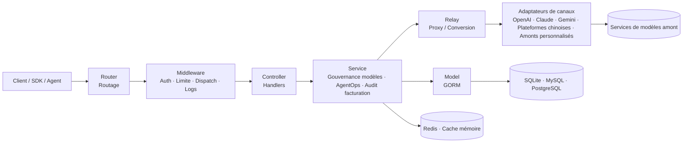

<div align="center">


# MAX API

🍥 **Gouvernance des modèles IA, AgentOps et infrastructure de services pour applications AGI**

<p align="center">
  <a href="./README.zh_CN.md">简体中文</a> |
  <a href="./README.zh_TW.md">繁體中文</a> |
  <a href="./README.md">English</a> |
  <strong>Français</strong> |
  <a href="./README.ja.md">日本語</a>
</p>

<p align="center">
  <a href="https://raw.githubusercontent.com/MAX-API-Next/MAX-API/main/LICENSE"></a><!--
  --><a href="https://github.com/MAX-API-Next/MAX-API/releases/latest"></a><!--
  --><a href="https://hub.docker.com/r/cscitechtop/max-api"></a><!--
  --><a href="https://goreportcard.com/report/github.com/MAX-API-Next/MAX-API"></a>
</p>

<p align="center">
  <a href="#-positionnement-du-projet">Positionnement</a> •
  <a href="#-canaux-de-publication">Canaux de publication</a> •
  <a href="#-cadre-de-gouvernance">Gouvernance</a> •
  <a href="#-cas-dusage">Cas d'usage</a> •
  <a href="#-démarrage-rapide">Démarrage</a> •
  <a href="#-capacités-clés">Capacités</a> •
  <a href="#-configuration-de-gouvernance">Configuration</a> •
  <a href="#-vue-densemble-de-larchitecture">Architecture</a> •
  <a href="#-prise-en-charge-des-modèles-et-interfaces-ia">Modèles & API</a> •
  <a href="#-déploiement">Déploiement</a> •
  <a href="#-faq">FAQ</a> •
  <a href="#-licence">Licence</a>
</p>

</div>

---

## 📝 Description du projet

MAX API est un projet d'infrastructure pour la gouvernance des modèles IA, l'AgentOps et les services applicatifs. Il est initié, maintenu et exploité sur le long terme par des passionnés d'AGI issus d'organismes de recherche et d'universités. Il fournit aux développeurs, chercheurs, équipes et organisations une couche de service stable et réutilisable. Le projet se concentre sur les problèmes d'exploitation qui apparaissent lorsque les applications IA passent en production : multiplication des modèles, évolution fréquente des API amont, chaînes d'appels Agent plus longues, pression accrue sur les coûts et l'audit. MAX API fournit une couche unifiée d'accès, d'authentification, de routage, de facturation, d'observabilité et de gouvernance entre applications, Agents, utilisateurs, organisations et fournisseurs de modèles.

Axes d'investissement continus :

- **Gouvernance des modèles IA** : suivi continu des mises à jour de modèles, des changements d'API, des différences de paramètres, des règles de prix et des protocoles de tâches chez OpenAI, Azure OpenAI, AWS Bedrock, Vertex AI, Ollama, ainsi que chez DeepSeek, Qwen / Alibaba Cloud Model Studio, Zhipu GLM, Kimi, Doubao / Volcano Engine, Tencent Hunyuan, Baidu ERNIE / Qianfan, iFlytek Spark, MiniMax, 01.AI, SiliconFlow et d'autres plateformes. Le projet suit aussi Dify, RAGFlow, Kling, Seedance et d'autres écosystèmes applicatifs ou multimodaux.
- **Gouvernance AI Agent / AgentOps** : amélioration de la gouvernance des jetons, du contrôle d'accès aux modèles, du traçage des appels, de l'attribution des coûts, du diagnostic d'erreurs et de l'audit des journaux pour les Agents, workflows et appels d'outils.
- **Gouvernance de configuration des canaux** : matrice de capacités et validation de configuration lors de la création ou modification des canaux, avec affichage de `chat/completions`, `responses`, `embeddings`, `rerank`, `video tasks`, découverte de modèles, et alertes sur Base URL, JSON, région Vertex AI, identifiants Codex ou placeholders de tâches vidéo.
- **Optimisation opérationnelle et gouvernance des coûts** : routage, retry, limitation, préfacturation, remboursement en cas d'échec, observabilité, statistiques de coûts et analyse d'exploitation. Les scénarios token peuvent utiliser la facturation par expression et les scénarios de tâches asynchrones peuvent utiliser des rate-cards paramétrées.

> [!IMPORTANT]
> - Lors de la fourniture de services publics d'IA générative, les utilisateurs doivent respecter les obligations réglementaires applicables et gérer eux-mêmes les déclarations, licences, sécurité de contenu, vérification d'identité, conservation des journaux, fiscalité, paiement et autorisations amont requises dans leur juridiction.
> - Les capacités sensibles comme l'audit des journaux et la conservation de contenu ne doivent être activées qu'avec une base légale, une information claire, une isolation des permissions et des mesures de sécurité des données.
> - MAX API fournit une couche de gouvernance de passerelle pour les charges de travail de modèles et d'Agents. Il ne fournit pas de comptes amont, de clés API, d'entraînement de modèles de base, et ne remplace pas Dify, LangChain, MCP Server ni les frameworks d'orchestration d'Agents.

---

## 🚦 Canaux de publication

Les versions actuelles de MAX API sont divisées entre versions stables et versions Preview. Les versions Preview exposent plus tôt les nouvelles capacités et corrections afin que la communauté et les opérateurs puissent valider la compatibilité, la stabilité et la sécurité en environnement réel. Une version stable est publiée après 1 semaine de fonctionnement stable de la Preview correspondante, afin de réduire les risques de mise à niveau en production et d'améliorer la sécurité et la fiabilité du système.

Pour la production, privilégiez les versions stables. Utilisez les versions Preview dans des environnements de test ou de canary lorsque vous devez valider à l'avance de nouvelles fonctionnalités, corrections ou évolutions de compatibilité, avec sauvegarde de base de données et plan de rollback avant mise à niveau.

---

## 🎯 Positionnement du projet

À l'ère des applications AGI, MAX API se concentre sur une infrastructure ouverte de gouvernance des modèles IA et des AI Agents, afin de construire une couche de service, de gouvernance et d'exploitation permettant aux développeurs et organisations d'exécuter durablement applications IA et charges Agent :

- **Plan de gouvernance des modèles** : gestion unifiée des entrées de modèles, canaux, fournisseurs, protocoles, mappings, règles tarifaires, protocoles de tâches et interfaces multimodales.
- **Plan de contrôle AgentOps** : ne remplace pas les frameworks d'orchestration Agent ; fournit au niveau passerelle la gouvernance des jetons, le contrôle d'accès aux modèles, les journaux d'appel, le suivi des coûts, le diagnostic d'anomalies et l'analyse opérationnelle.
- **Plan de configuration des canaux** : réduit les risques de mauvaise configuration grâce aux matrices de capacités, validations de formulaires, découverte de modèles et modèles de protocole.
- **Couche d'adaptation protocoles/fournisseurs** : suit les API officielles internationales, les plateformes de modèles chinoises et les API OpenAI-compatible / non standard, puis les normalise en interfaces applicatives stables.
- **Gouvernance coût, quota et fiabilité** : routage de canaux, distribution pondérée, retry, limitation, préfacturation, remboursement d'échec, facturation par expression, prix fixes, rate-cards de tâches, multiplicateurs et statistiques d'usage.
- **Couche d'exploitation et d'audit organisationnelle** : utilisateurs, groupes, déploiement privé, rétention des données, audit et optimisation continue.
- **Modèles de gouvernance réutilisables** : capitalisation des templates de canaux, protocoles de tâches, configurations de prix, pratiques de déploiement et retours d'exploitation.

---

## 🧠 Cadre de gouvernance

MAX API place l'exécution des modèles IA et des AI Agents dans un cadre configurable, observable, calculable et auditable.

| Objet gouverné | Capacités MAX API | Objectif |
|----------|-------------------|------|
| Actifs modèles | Listes de modèles, mappings, groupes, restrictions, règles de prix et gestion multimodale | Savoir quels modèles existent, qui peut les utiliser, comment ils sont facturés et comment les basculer |
| Canaux amont | Fournisseurs, poids, groupes, état, clés, Base URL, overrides de chemins, matrice de capacités, validation, découverte et retry | Réduire les risques d'indisponibilité, hausse de prix, limites, erreurs de configuration ou changements d'API |
| Formats de protocole | OpenAI Compatible, Responses, Claude Messages, Gemini, Realtime, protocole vidéo générique et conversions | Donner aux applications des interfaces stables plutôt que les exposer aux différences de fournisseurs |
| Jetons Agent | API Key, groupes de jetons, périmètre de modèles, quotas, expiration et contrôle d'accès | Fournir aux Agents et workflows des identifiants indépendants, révocables et limitables |
| Usage et coûts | Journaux, statistiques, facturation par expression, JSON par paliers, rate-card de tâches, préfacturation et remboursements | Attribuer les coûts par utilisateur, jeton, modèle, canal et groupe |
| Tâches asynchrones | Soumission, polling, mapping d'état, proxy de résultat et facturation de tâches vidéo | Gouverner les tâches multimodales longues, multi-états et multi-fournisseurs |
| Audit et sécurité | Audit admin, journaux d'erreurs, limites de requêtes, timeout streaming, login et permissions | Fournir une frontière d'audit contrôlée en déploiement privé et contexte conforme |
| Exploitation organisationnelle | Utilisateurs, groupes, solde, paiement, paramètres système, tableaux de bord et configuration ops | Soutenir l'exploitation continue d'équipes, institutions, entreprises ou communautés |

---

## 🧩 Cas d'usage

- **Plateforme interne de gouvernance des modèles IA** : gestion centralisée des utilisateurs, jetons, modèles, canaux, groupes, permissions, prix et factures.
- **Socle d'exécution et de gouvernance Agent** : passerelle de modèles, isolation des jetons, contrôle des coûts, observabilité, diagnostic et audit pour Agents, workflows et outils.
- **Centre d'adaptation modèles chinois et multi-fournisseurs** : suivi des API et prix, réduction du coût d'adaptation via configuration de canaux, mappings, overrides de chemins et templates de protocole.
- **Plateforme de gouvernance multimodale** : accès unifié au texte, image, vidéo, audio, embeddings, rerank et temps réel, avec gestion d'état, proxy de résultat et facturation pour les tâches asynchrones.
- **Comptabilité des coûts modèles et Agents** : quotas, calcul de coûts, statistiques de facturation et analyse par utilisateur, jeton, modèle, canal et groupe.
- **Environnement privé et conforme** : pour les équipes ou organisations qui doivent maîtriser clés, données, permissions, journaux, audit et stratégie tarifaire.

---

## 🚀 Démarrage rapide

SQLite est utilisé par défaut ; aucun service de base de données externe n'est requis pour un essai local.

```bash
# 1. Récupérer l'image
docker pull cscitechtop/max-api:latest

# 2. Lancer le service et persister les données dans ./data
docker run --name max-api -d --restart always \
  -p 3000:3000 \
  -e TZ=Asia/Shanghai \
  -v ./data:/data \
  cscitechtop/max-api:latest

# 3. Ouvrir la console
# Navigateur : http://localhost:3000
```

Pour la production, utilisez Docker Compose et configurez explicitement base de données, Redis, secret de session, secret de chiffrement et répertoire de journaux.

```bash
git clone https://github.com/MAX-API-Next/MAX-API.git
cd MAX-API

# Modifier docker-compose.yml selon les mots de passe et variables nécessaires
docker compose up -d
```

> [!WARNING]
> Si vous exploitez ce projet comme service public d'IA générative ou service API, finalisez d'abord les autorisations amont, obligations réglementaires, sécurité de contenu, vérification d'identité, conservation des journaux, fiscalité, paiement et conditions utilisateur.

---

## ✨ Capacités clés

### Gouvernance des modèles IA

| Capacité | Description |
|------|------|
| Entrée modèle unifiée | Prend en charge OpenAI-compatible, Responses, Claude Messages, Gemini, Realtime et d'autres protocoles via une passerelle unique |
| Pool multi-fournisseurs | OpenAI, Azure, Claude, Gemini, AWS Bedrock, Vertex AI, Ollama, et suivi/adaptation de DeepSeek, Qwen, Zhipu GLM, Kimi, Doubao, Hunyuan, ERNIE, iFlytek Spark, MiniMax, 01.AI, SiliconFlow, etc. |
| Adaptation de l'écosystème amont | Gouvernance des interfaces Codex, Dify, RAGFlow, Kling, Seedance et autres plateformes applicatives, Agent ou multimodales |
| Mapping et périmètre d'accès | Listes de modèles par canal, mappings, groupes utilisateur, groupes de jetons et restrictions de modèles |
| Matrice de capacités des canaux | Affiche `chat/completions`, `responses`, `Claude Messages`, `Gemini native`, `embeddings`, `images`, `audio`, `rerank`, `video tasks`, `model discovery` |
| Validation des canaux | Vérifie API Key, modèles, Base URL, configuration JSON, région Vertex AI, identifiants Codex, découverte de modèles et placeholders vidéo |
| Gouvernance multimodale | Chat, image, vidéo, audio, embeddings, rerank, temps réel, et gestion des tâches asynchrones vidéo |
| Protocole vidéo générique | Configure soumission, requête, progression, mapping d'état, erreur et chemins de résultats ; chemins par défaut `/v1/videos/create` et `/v1/videos/{task_id}` |
| Conversion protocolaire et amonts personnalisés | Conversions OpenAI Compatible, Claude Messages, Gemini, ainsi que URL amont autorisées, overrides et règles de parsing de tâches |

### Gouvernance AI Agent / AgentOps

| Capacité | Description |
|------|------|
| Isolation des jetons Agent | Créer des API Key indépendantes pour Agents, workflows, plugins, appels d'outils ou utilisateurs |
| Contrôle d'accès modèle | Contrôler modèles, canaux et quota par utilisateur, jeton, groupe, restriction de modèle et politique de canal |
| Observabilité de chaîne d'appels | Journaux, statistiques, canal touché, latence, erreurs et retries pour diagnostiquer les Agents |
| Attribution des coûts | Statistiques par modèle, canal, utilisateur, groupe et jeton |
| Audit administrateur | Audit côté admin en déploiement privé ; les API de journaux utilisateur filtrent les champs réservés aux administrateurs |
| Tableau de bord ops | Analyses, gestion utilisateurs, gestion canaux, paramètres système et analyse d'exploitation |

### Gouvernance des coûts, de la facturation et de la fiabilité

**Expressions de prix des modèles**

- **Une expression = une règle complète de tarification token** : paliers, cache hit, tokens image/audio, remises horaires et majorations dynamiques peuvent être décrits en une ligne.
- **Le prix correspond au prix réel** : les coefficients peuvent représenter directement des dollars par million de tokens ; `p * 2.5` signifie 2,5 USD par million de tokens d'entrée. Le mode multiplicateur historique reste compatible.
- **Édition visuelle + brute** : saisie guidée ou édition directe de l'expression, avec modèles prédéfinis.
- **Maintenance JSON unifiée** : `Tiered billing JSON` maintient plusieurs `{ enabled, expr }` et met à jour `billing_mode` et `billing_expr` de manière atomique.
- **Normalisation automatique des tokens** : sépare cache, image, audio et autres sous-catégories pour éviter la double facturation.

**Facturation des tâches et fiabilité**

- Rate-card paramétrée pour tâches asynchrones vidéo, avec prix selon modèle, `vendor`, durée, qualité, audio, entrée vidéo, etc. `task_billing_setting.rate_cards` peut séparer Sora, Veo, Seedance, Kling et autres fournisseurs.
- Compatible avec facturation à l'usage, par appel, cache hit, multiplicateurs de modèle, groupe et canal.
- Préfacturation, remboursement d'échec, traitement d'exceptions et journaux de consommation.
- Routage pondéré, retry, contournement des canaux désactivés et routage par modèle.
- Cache Redis et mémoire pour déploiement mono ou multi-nœud.

### Sécurité et gestion d'organisation

- JWT, WebAuthn/Passkeys, OAuth, OIDC, Telegram, Discord, LinuxDO et autres méthodes de connexion.
- Contrôle des administrateurs, utilisateurs, groupes, jetons et accès modèles.
- Limites de taille de requête, timeout streaming, journaux d'erreurs et health checks.
- Secret de session, secret de chiffrement et cache Redis partagé en multi-nœud.

---

## 🆚 Pourquoi utiliser une passerelle

| Dimension | SDK / API officiels en direct | Via la passerelle MAX API |
|------|------------------------|-------------------|
| Accès modèles | Un SDK, une auth et des paramètres par fournisseur | Entrée unique, intégration unique, réutilisation multi-modèles |
| Gouvernance modèles | Modèles, prix, permissions et canaux dispersés | Gestion unifiée des modèles, canaux, mappings, groupes, quotas et prix |
| Accès Agent | Les Agents détiennent directement les clés amont | Jetons indépendants avec limites de modèles, quota, expiration et groupe |
| Différences de protocole | L'application adapte Claude, Gemini, Responses, etc. | La passerelle convertit les protocoles et adapte les fournisseurs |
| Échecs | Retry, fallback et normalisation d'erreurs côté application | Retry de canaux, routage pondéré et traitement d'erreurs intégrés |
| Coûts | Factures dispersées, attribution difficile | Quotas, facturation, statistiques et journaux unifiés par jeton et modèle |
| Audit | Journaux applicatifs dispersés | Entrée d'audit admin unifiée, filtrage des champs admin pour utilisateurs |
| Privé | Clés, journaux et stratégie tarifaire dispersés | Auto-hébergement et contrôle des clés, données, journaux et politiques |

---

## 🧭 Vue d'ensemble de l'architecture

MAX API utilise une architecture en couches : les requêtes des applications, SDK ou Agents entrent par une interface unifiée, passent par routeur, middleware, contrôleurs et services métier, puis sont adaptées par la couche relay vers le fournisseur amont. La couche données et cache assure persistance et accélération pour gouvernance de modèles, jetons Agent, facturation, journaux, audit et état des tâches.



### Structure des répertoires

| Répertoire | Rôle |
|------|------|
| `router/` | Routage HTTP : API, relay, dashboard et web |
| `controller/` | Handlers, parsing des paramètres, entrées métier authentifiées et réponses |
| `service/` | Logique métier : modèles, AgentOps, journaux, facturation, audit, tâches, canaux et configuration |
| `model/` | Modèles de données et accès DB via GORM, compatible SQLite, MySQL, PostgreSQL |
| `relay/` | Relay API IA, conversion de protocoles et adaptation fournisseur |
| `relay/channel/` | Adaptateurs openai, claude, gemini, aws, etc. |
| `middleware/` | Auth, limitation, CORS, logs, distribution de requêtes et contexte |
| `setting/` | Prix modèles, facturation tâches, opérations, système, sécurité et performance |
| `common/` | Utilitaires JSON, chiffrement, Redis, limitation et variables d'environnement |
| `dto/` / `types/` | Types de requêtes, réponses, erreurs et formats relay |
| `constant/` | Types d'API, types de canaux et clés de contexte |
| `i18n/` / `oauth/` / `pkg/` | i18n backend, OAuth et packages internes |
| `web/` | Conteneur du frontend ; thème par défaut dans `web/default/` |

### Stack technique

| Couche | Technologie |
|------|------|
| Backend | Go 1.25+, Gin, GORM v2 |
| Frontend | React 19, TypeScript, Rsbuild, Base UI, Tailwind CSS |
| Gestion de paquets | Bun workspace |
| Base de données | SQLite / MySQL ≥ 5.7.8 / PostgreSQL ≥ 9.6 |
| Cache | Redis + cache mémoire |
| Authentification | JWT, WebAuthn/Passkeys, OAuth, OIDC |

---

## 🤖 Prise en charge des modèles et interfaces IA

> Les modèles réellement disponibles dépendent de vos autorisations amont, de la configuration des canaux, des mappings et du support fournisseur. MAX API gouverne ces capacités, mais ne fournit pas les services de modèles amont.

| Type | Description |
|------|------|
| OpenAI-Compatible | Chat Completions, Embeddings, Images, Audio et interfaces compatibles |
| OpenAI Responses | Requêtes Responses, relay et compatibilité pour les nouveaux protocoles OpenAI |
| Claude Messages | Conversion Claude Messages ↔ format OpenAI-compatible |
| Google Gemini | Chat, texte et conversions partielles Gemini |
| Azure OpenAI | Azure OpenAI et Realtime |
| AWS Bedrock | Accès Bedrock Runtime |
| Plateformes et applications amont | AWS, Azure, Vertex, Ollama, Codex, Dify, RAGFlow, Kling, Seedance, etc. |
| Modèles et plateformes chinoises | DeepSeek, Qwen / Alibaba Cloud Model Studio, Zhipu GLM, Kimi, Doubao / Volcano Engine, Tencent Hunyuan, Baidu ERNIE / Qianfan, iFlytek Spark, MiniMax, 01.AI, SiliconFlow, etc. |
| `rerank` | Modèles Cohere, Jina et autres pour RAG et chaînes de recherche Agent |
| Midjourney / Suno / Dify | Adaptateurs image, musique et workflow |
| API de tâches vidéo | `/v1/videos/create`, `/v1/videos/{task_id}` : soumission, polling, mapping d'état, proxy de résultat et facturation paramétrée |
| Amonts personnalisés | URL autorisées, règles d'adaptation, overrides, mapping d'état, chemin d'erreur et parsing de résultat |

### Interfaces principales

<details>
<summary>Voir les catégories</summary>

- Chat : `/v1/chat/completions`
- Responses : `/v1/responses`
- Images : `/v1/images/*`
- Audio : `/v1/audio/*`
- Vidéo : `/v1/videos/*`
- Embeddings : `/v1/embeddings`
- Rerank : `/v1/rerank`
- Realtime : interface compatible OpenAI Realtime
- Claude Messages : entrée native Claude
- Gemini : entrée format Google Gemini

</details>

### Prise en charge de Reasoning Effort

<details>
<summary>Voir des exemples de noms de modèles</summary>

- `o3-mini-high`, `o3-mini-medium`, `o3-mini-low`
- `gpt-5-high`, `gpt-5-medium`, `gpt-5-low`
- `claude-3-7-sonnet-20250219-thinking`
- `gemini-2.5-flash-thinking`, `gemini-2.5-flash-nothinking`, `gemini-2.5-pro-thinking`, `gemini-2.5-pro-thinking-128`
- Les suffixes `-low`, `-medium`, `-high` peuvent aussi contrôler l'effort de raisonnement Gemini.

</details>

---

## 🔧 Configuration de gouvernance

### Configuration initiale recommandée

1. Après le déploiement, ouvrez la console et créez ou confirmez le compte administrateur.
2. Configurez paramètres système, inscription, méthodes de connexion et limites de sécurité.
3. Ajoutez les canaux amont avec API Key autorisée, Base URL, modèles, mappings et paramètres.
4. Configurez groupes utilisateurs, groupes de jetons, restrictions de modèles, quotas et règles de prix.
5. Créez des jetons indépendants pour applications, Agents ou workflows avec périmètre et quota.
6. Configurez retry, journaux, cache et statistiques de consommation.
7. Pour l'audit de contenu côté admin, activez « System Settings → Security & Limits → Log Audit » en contexte conforme, et vérifiez que « Record quota usage (Log Maintenance) » est activé.

### Matrice de capacités et validation des canaux

À la création ou modification d'un canal, le système affiche une matrice de capacités et des résultats de validation. Les noms techniques restent en anglais (`chat/completions`, `responses`, `embeddings`, `rerank`, `video tasks`) et les descriptions expliquent les usages.

La validation couvre notamment : API Key manquante, liste de modèles vide, Base URL ou configuration requise absente, Base URL terminée par `/v1`, JSON non objet, région Vertex AI sans `default`, clé de service invalide, identifiants Codex incomplets, découverte de modèles non supportée, ou chemin de requête vidéo sans `{task_id}`, `{operation_name}` ou `{upstream_task_id}`.

### Protocole générique de tâches vidéo

Les fournisseurs vidéo diffèrent souvent par chemins, task ID, état, progression, erreurs et URL de résultat. MAX API généralise cette capacité aux canaux OpenAI, Ali, Gemini, MiniMax, Vertex AI, VolcEngine, Kling, Jimeng, Vidu, Doubao Video, Sora, etc.

- **Override de chemins uniquement** : configurer `submit_path` et `query_path` tout en conservant le parseur officiel du canal.
- **Parsing complet** : définir `task_protocol = "generic_video_task"` et configurer task ID, état, progression, URL de résultat, erreur et mapping d'état.

Chemins par défaut :

```json
{
  "task_protocol": "generic_video_task",
  "task_protocol_config": {
    "submit_path": "/v1/videos/create",
    "query_path": "/v1/videos/{task_id}",
    "task_id_path": "task_id",
    "status_path": "status",
    "progress_path": "progress",
    "result_url_paths": ["result.primary_url", "result.urls.0", "data.result.primary_url", "url", "video_url", "download_url"],
    "error_message_path": "error_message",
    "status_map": { "queued": "QUEUED", "running": "IN_PROGRESS", "succeeded": "SUCCESS", "failed": "FAILURE" }
  }
}
```

Les chemins de requête prennent en charge `{task_id}`, `{operation_name}` et `{upstream_task_id}`. `{operation_name}` peut conserver des chemins multi-segments pour Gemini / Vertex. Le contenu vidéo peut être proxyfié via `/v1/videos/{task_id}/content` afin de masquer le domaine amont, avec authentification, protection SSRF et ports autorisés.

### Maintenance JSON de la facturation

- **Tiered billing JSON** : maintient plusieurs règles `{ enabled, expr }` et synchronise `billing_mode` / `billing_expr`.
- **Task rate-card JSON** : maintient `task_billing_setting.rate_cards` pour les tâches asynchrones, avec partition `vendor` pour Sora, Veo, Seedance, Kling, etc.

```json
{
  "model-name": {
    "enabled": true,
    "expr": "len <= 200000 ? tier(\"standard\", p * 3 + c * 15) : tier(\"long_context\", p * 6 + c * 22.5)"
  }
}
```

```json
{
  "vendor/model-name": {
    "vendor": "kling",
    "unit": "second",
    "quantity_field": "duration",
    "default_quantity": 5,
    "strict": true,
    "defaults": { "quality": "std", "has_audio": "false" },
    "rows": [{ "id": "std_no_audio", "match": { "quality": "std", "has_audio": "false" }, "unit_price": 0.6 }]
  }
}
```

### Entrées d'exploitation courantes

| Fonction | Description |
|------|------|
| Gestion des canaux | Fournisseurs, mappings, poids, clés, chemins, état, matrice et validation |
| Modèles et prix | Modèles, prix, expressions, JSON par paliers, rate-cards et affichage |
| Gestion des jetons | Jetons pour applications, Agents, workflows, outils ou utilisateurs |
| Gestion utilisateurs | Utilisateurs, groupes, soldes, permissions et états |
| Journaux d'usage | Appels, consommation, latence, erreurs, canaux et audit visible admin |
| Paramètres système | Sécurité, audit, prix, tâches, opérations, logs, paiement et site |
| Tableau de bord | Requêtes, usage modèles, consommation, état canaux et coûts des jetons Agent |

---

## 🚢 Déploiement

### Exigences

| Composant | Exigence |
|------|------|
| Moteur conteneur | Docker / Docker Compose |
| Base locale | SQLite, monter `/data` avec Docker |
| Base distante | MySQL ≥ 5.7.8 ou PostgreSQL ≥ 9.6 |
| Cache | Mémoire en mono-nœud, Redis recommandé en multi-nœud |
| Build frontend | Bun workspace, conserver `web/package.json` et `web/bun.lock` |

### Variables d'environnement recommandées

<details>
<summary>Voir les variables courantes</summary>

| Variable | Description | Défaut |
|--------|------|--------|
| `SESSION_SECRET` | Secret de session, requis en multi-nœud | - |
| `CRYPTO_SECRET` | Secret de chiffrement, requis avec Redis ou multi-nœud | - |
| `SQL_DSN` | Chaîne de connexion DB | - |
| `REDIS_CONN_STRING` | Chaîne Redis | - |
| `STREAMING_TIMEOUT` | Timeout streaming en secondes | `300` |
| `STREAM_SCANNER_MAX_BUFFER_MB` | Buffer max par ligne pour streaming | `64` |
| `MAX_REQUEST_BODY_MB` | Taille max du body décompressé | `32` |
| `AZURE_DEFAULT_API_VERSION` | Version API Azure par défaut | `2025-04-01-preview` |
| `ERROR_LOG_ENABLED` | Activation des journaux d'erreurs | `false` |
| `NODE_NAME` | Nom du nœud | - |
| `PYROSCOPE_URL` | URL Pyroscope | - |
| `PYROSCOPE_APP_NAME` | Nom d'application Pyroscope | `max-api` |
| `PYROSCOPE_BASIC_AUTH_USER` | Utilisateur Basic Auth | - |
| `PYROSCOPE_BASIC_AUTH_PASSWORD` | Mot de passe Basic Auth | - |
| `PYROSCOPE_MUTEX_RATE` | Taux mutex | `5` |
| `PYROSCOPE_BLOCK_RATE` | Taux block | `5` |
| `HOSTNAME` | Label hôte | `max-api` |

</details>

### Docker Compose

```bash
git clone https://github.com/MAX-API-Next/MAX-API.git
cd MAX-API
# Modifier mots de passe, secrets et proxy HTTPS selon besoin
docker compose up -d
```

### Docker

```bash
docker run --name max-api -d --restart always \
  -p 3000:3000 \
  -e TZ=Asia/Shanghai \
  -v ./data:/data \
  cscitechtop/max-api:latest
```

```bash
docker run --name max-api -d --restart always \
  -p 3000:3000 \
  -e SQL_DSN="root:123456@tcp(mysql:3306)/max-api" \
  -e TZ=Asia/Shanghai \
  -v ./data:/data \
  cscitechtop/max-api:latest
```

### Construire depuis les sources

```bash
git clone https://github.com/MAX-API-Next/MAX-API.git
cd MAX-API
docker build -t cscitechtop/max-api:latest .
```

> [!TIP]
> Le frontend utilise Bun workspace. Conservez `web/package.json`, `web/bun.lock` et `web/default/package.json`, sinon les dépendances `catalog:` ne seront pas résolues.

### Notes multi-nœuds

> [!WARNING]
> - Tous les nœuds doivent partager `SESSION_SECRET`.
> - Avec Redis partagé, tous les nœuds doivent partager `CRYPTO_SECRET`.
> - Définissez `NODE_NAME` pour identifier les nœuds dans logs et audit.
> - En production, utilisez DB externe, Redis externe, HTTPS et sauvegardes fiables.

---

## 🗺️ Feuille de route

- **Approfondissement de la gouvernance des modèles** : catalogue, prix, permissions, mappings, tags de capacités et changements fournisseurs.
- **Approfondissement AgentOps** : chaînes d'appels, attribution des coûts, diagnostic, outils et services MCP-style.
- **Gouvernance multimodale** : facturation, limitation, suivi d'état et proxy de résultats pour image, vidéo, audio et temps réel.
- **Conversions de protocoles** : OpenAI Compatible, Responses, Claude Messages, Gemini et autres.
- **Suivi des modèles et plateformes chinoises** : API, prix, protocoles, canaux, prix et tâches réutilisables.
- **Templates fournisseurs** : overrides, protocoles, mapping d'état, parsing d'erreurs et résultats.
- **Audit et opérations** : chaînes de requêtes, coûts, erreurs, audit admin, rétention et rapports.
- **Opérations organisationnelles** : multi-tenant, groupes, facturation, permissions, contrôle des risques et déploiement privé.

Les demandes et suggestions sont bienvenues dans [GitHub Issues](https://github.com/MAX-API-Next/MAX-API/issues).

---

## ❓ FAQ

<details><summary><strong>MAX API fournit-il des services de modèles ou des clés API ?</strong></summary>

Non. MAX API est une couche de gouvernance de passerelle. Il ne fournit pas de comptes, clés, entraînement ou services de modèles amont.

</details>

<details><summary><strong>Quel est le lien avec les frameworks Agent ?</strong></summary>

MAX API ne remplace pas Dify, LangChain, MCP Server, moteurs de workflow ou applications Agent. Il se place entre eux et les modèles amont pour gérer accès, jetons, coûts, routage, logs et audit.

</details>

<details><summary><strong>Pourquoi parler de gouvernance de modèles IA ?</strong></summary>

Dans une organisation, un modèle implique fournisseur, prix, contexte, protocole, permissions, fiabilité et audit. MAX API unifie configuration, observation et calcul.

</details>

<details><summary><strong>Quelles bases de données sont supportées ?</strong></summary>

SQLite, MySQL ≥ 5.7.8 et PostgreSQL ≥ 9.6. SQLite convient aux essais ; MySQL ou PostgreSQL est recommandé en production.

</details>

<details><summary><strong>Peut-on migrer depuis New API / One API ?</strong></summary>

Les principales structures sont compatibles. Sauvegardez la base et vérifiez canaux, multiplicateurs, utilisateurs, jetons et journaux en environnement de test.

</details>

<details><summary><strong>Points d'attention en multi-nœud ?</strong></summary>

Utilisez le même `SESSION_SECRET` partout ; avec Redis partagé, utilisez aussi le même `CRYPTO_SECRET`.

</details>

<details><summary><strong>Réponses image, streaming ou grosses réponses tronquées ?</strong></summary>

Augmentez `STREAM_SCANNER_MAX_BUFFER_MB`.

</details>

<details><summary><strong>Requête trop grande avec 413 ?</strong></summary>

Ajustez `MAX_REQUEST_BODY_MB`, calculé après décompression.

</details>

<details><summary><strong>Les utilisateurs voient-ils les contenus d'audit admin ?</strong></summary>

Les API de journaux utilisateur filtrent les champs réservés admin. Les administrateurs système ou DB peuvent toujours accéder aux données, donc les permissions doivent être strictement contrôlées.

</details>

<details><summary><strong>Pourquoi Docker signale des dépendances `catalog:` non résolues ?</strong></summary>

Le frontend utilise Bun workspace ; `catalog:` est défini dans `web/package.json`. Ne remplacez pas ce fichier par `web/default/package.json` et conservez `web/bun.lock`.

</details>

---

## 🔗 Projets connexes

| Projet | Description |
|------|------|
| [One API](https://github.com/songquanpeng/one-api) | Licence MIT |
| [New API](https://github.com/QuantumNous/new-api) | Licence AGPLv3 |
| [Midjourney-Proxy](https://github.com/novicezk/midjourney-proxy) | Licence Apache-2.0 |
| [Suno API](https://github.com/Suno-API/Suno-API) | Licence MIT |

### Outils associés

| Projet | Description |
|------|------|
| [max-api-key-tool](https://github.com/MAX-API-Next/MAX-API-key-tool) | Outil de consultation de quota de clés |
| [max-api-horizon](https://github.com/MAX-API-Next/MAX-API-horizon) | Édition MAX API optimisée hautes performances |

---

## 📚 Documentation et support

| Ressource | Lien |
|------|------|
| Documentation officielle | [MAX-API-Next/MAX-API](https://github.com/MAX-API-Next/MAX-API) |
| Signalement | [GitHub Issues](https://github.com/MAX-API-Next/MAX-API/issues) |
| Dernières versions | [Releases](https://github.com/MAX-API-Next/MAX-API/releases) |
| DeepWiki | [Ask DeepWiki](https://deepwiki.com/MAX-API-Next/MAX-API) |

Contributions de code, documentation, expériences d'adaptation fournisseur et pratiques de déploiement sont bienvenues.

---

## 📜 Licence

Ce projet est sous [GNU Affero General Public License v3.0 (AGPLv3)](./LICENSE).

Si vous modifiez le projet et le fournissez aux utilisateurs via le réseau, comprenez et respectez les obligations AGPLv3 de disponibilité du code source. Pour coopération commerciale, institutionnelle ou autres questions de licence : maxapi@max-api.ai.

---

## 🌟 Historique des étoiles

<div align="center">

[](https://star-history.com/#MAX-API-Next/MAX-API&Date)

</div>

---

<div align="center">

### 💖 Merci d'utiliser MAX API

Si ce projet vous aide, pensez à lui donner une ⭐ Star.

**[Documentation officielle](https://github.com/MAX-API-Next/MAX-API)** • **[Issues](https://github.com/MAX-API-Next/MAX-API/issues)** • **[Releases](https://github.com/MAX-API-Next/MAX-API/releases)**

<sub>Built with ❤️ by MAX-API-Next</sub>

</div>
