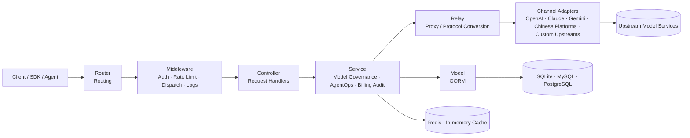

<div align="center">


# MAX API

🍥 **AI モデルガバナンス、AgentOps、AGI アプリケーションサービス基盤**

<p align="center">
  <a href="./README.zh_CN.md">简体中文</a> |
  <a href="./README.zh_TW.md">繁體中文</a> |
  <a href="./README.md">English</a> |
  <a href="./README.fr.md">Français</a> |
  <strong>日本語</strong>
</p>

<p align="center">
  <a href="https://raw.githubusercontent.com/MAX-API-Next/MAX-API/main/LICENSE"></a><!--
  --><a href="https://github.com/MAX-API-Next/MAX-API/releases/latest"></a><!--
  --><a href="https://hub.docker.com/r/cscitechtop/max-api"></a><!--
  --><a href="https://goreportcard.com/report/github.com/MAX-API-Next/MAX-API"></a>
</p>

<p align="center">
  <a href="#-プロジェクトの位置づけ">位置づけ</a> •
  <a href="#-リリースチャネル">リリースチャネル</a> •
  <a href="#-ガバナンスフレームワーク">ガバナンス</a> •
  <a href="#-利用シーン">利用シーン</a> •
  <a href="#-クイックスタート">クイックスタート</a> •
  <a href="#-主な機能">機能</a> •
  <a href="#-ガバナンス設定">設定</a> •
  <a href="#-アーキテクチャ概要">アーキテクチャ</a> •
  <a href="#-ai-モデルとインターフェース対応">モデルと API</a> •
  <a href="#-デプロイ">デプロイ</a> •
  <a href="#-faq">FAQ</a> •
  <a href="#-ライセンス">ライセンス</a>
</p>

</div>

---

## 📝 プロジェクト説明

MAX API は、研究機関と大学に所属する AGI 愛好者によって立ち上げられ、長期的に保守・運営されている AI モデルガバナンス、AgentOps、アプリケーションサービス基盤プロジェクトです。開発者、研究者、チーム、組織に対して、安定して再利用可能なサービスレイヤーを提供します。AI アプリケーションが実運用に入ると、モデル数の増加、上流 API の頻繁な変更、Agent の呼び出しチェーンの長大化、コストと監査の負担増加が発生します。MAX API は、アプリケーション、Agent、ユーザー、組織、上流モデルサービスの間に、アクセス、認証、ルーティング、課金、可観測性、ガバナンスの統一レイヤーを提供します。

継続的に注力する領域：

- **AI モデルガバナンス**：OpenAI、Azure OpenAI、AWS Bedrock、Vertex AI、Ollama、および DeepSeek、Qwen / Alibaba Cloud Model Studio、Zhipu GLM、Kimi、Doubao / Volcano Engine、Tencent Hunyuan、Baidu ERNIE / Qianfan、iFlytek Spark、MiniMax、01.AI、SiliconFlow などのモデル更新、API 変更、パラメータ差分、価格ルール、タスクプロトコルを継続的に追跡します。Dify、RAGFlow、Kling、Seedance などのアプリケーション・マルチモーダルエコシステムも対象です。
- **AI Agent ガバナンス / AgentOps**：Agent、ワークフロー、ツール呼び出しのシーンに対して、トークン管理、モデルアクセス制御、呼び出しトレース、コスト帰属、障害診断、ログ監査を強化します。
- **チャネル設定ガバナンス**：チャネル作成・編集画面で、`chat/completions`、`responses`、`embeddings`、`rerank`、`video tasks`、model discovery などの能力を示すマトリクスと設定バリデーションを提供し、Base URL、JSON、Vertex AI リージョン、Codex 認証情報、動画タスクプレースホルダーなどのリスクを事前に検出します。
- **運用最適化とコストガバナンス**：チャネルルーティング、失敗時 retry、レート制限、事前課金、失敗時返金、ログ可観測性、コスト統計、運用分析を継続的に改善します。token 系のシーンでは式ベース課金と統一 JSON 設定、動画などの非同期タスクではパラメータ化された rate-card を利用できます。

> [!IMPORTANT]
> - 公開向けに生成 AI サービスを提供する場合、利用者は管轄地域の規制に従い、届出、許認可、コンテンツ安全、本人確認、ログ保存、税務、決済、上流認可などを自ら完了する必要があります。
> - ログ監査やコンテンツ保存などの機微な機能は、法的根拠、明確な通知、権限分離、データ安全対策がある場合にのみ有効化してください。
> - MAX API はモデルと Agent ワークロードのゲートウェイガバナンスレイヤーです。上流モデルアカウント、API Key、基盤モデル学習機能は提供せず、Dify、LangChain、MCP Server などの Agent オーケストレーション / アプリケーション開発フレームワークを置き換えるものでもありません。

---

## 🚦 リリースチャネル

現在の MAX API リリースは、正式版と Preview プレビュー版に分かれています。Preview 版では新機能や修正を先行公開し、コミュニティと運用者が実環境で互換性、安定性、セキュリティを検証できるようにします。正式版は、対応する Preview 版が 1 週間安定稼働した後に公開され、本番環境のアップグレードリスクを抑え、システムの安全性と信頼性を高めます。

本番環境では正式版を優先して利用してください。新機能、修正、互換性変更を早期に検証する場合は、テスト環境またはカナリア環境で Preview 版を使用し、アップグレード前にデータベースバックアップとロールバック手順を準備してください。

---

## 🎯 プロジェクトの位置づけ

AGI アプリケーション時代において、MAX API はオープンな AI モデルガバナンスと AI Agent ガバナンス基盤に注力し、開発者と組織が AI アプリケーションと Agent ワークロードを安定運用するためのサービス、ガバナンス、運用レイヤーを構築します。

- **モデルガバナンスプレーン**：モデル入口、チャネル、プロバイダー、プロトコル形式、モデルマッピング、価格ルール、タスクプロトコル、マルチモーダル API を統一管理します。
- **AgentOps コントロールプレーン**：Agent フレームワークを置き換えるのではなく、ゲートウェイ層でトークン管理、モデルアクセス制御、呼び出しログ、コスト追跡、障害診断、運用分析を提供します。
- **チャネル設定プレーン**：能力マトリクス、フォーム検証、モデル発見、プロトコルテンプレートによって、上流チャネル追加や非標準 API の保守における設定ミスを減らします。
- **プロトコル・プロバイダー適応レイヤー**：海外公式 API、中国国内モデルプラットフォーム API、OpenAI-compatible / 非標準 API の変化を追跡し、安定したアプリケーション側インターフェースへ正規化します。
- **コスト、クォータ、信頼性ガバナンス**：チャネルルーティング、重み付き分配、retry、レート制限、事前課金、失敗時返金、式ベース課金、固定価格、タスク rate-card、倍率課金、利用統計をサポートします。
- **組織運用・監査レイヤー**：チーム、研究機関、企業、コミュニティ向けに、ユーザー管理、グループ管理、プライベートデプロイ、データ保持、監査、継続運用最適化を提供します。
- **再利用可能なガバナンステンプレート**：チャネルテンプレート、タスクプロトコルテンプレート、価格設定、デプロイ実践、運用ノウハウを蓄積します。

---

## 🧠 ガバナンスフレームワーク

MAX API は、AI モデルと AI Agent の実行プロセスを、設定可能・観測可能・計算可能・監査可能なガバナンスフレームワークに組み込みます。

| ガバナンス対象 | MAX API が提供する能力 | 目的 |
|----------|-------------------|------|
| モデル資産 | モデル一覧、モデルマッピング、モデルグループ、モデル制限、価格ルール、マルチモーダル API 管理 | どのモデルがあり、誰が使え、どう課金され、どう切り替えるかを把握する |
| 上流チャネル | プロバイダーチャネル、重み、グループ、状態、キー、Base URL、パス上書き、能力マトリクス、設定検証、モデル発見、失敗時 retry | 単一プロバイダー障害、値上げ、制限、設定ミス、API 変更のリスクを下げる |
| プロトコル形式 | OpenAI Compatible、Responses、Claude Messages、Gemini、Realtime、汎用動画タスクプロトコルなど | アプリケーション側が各社の差分を直接負担しないようにする |
| Agent トークン | API Key、トークングループ、モデル範囲、クォータ、期限、アクセス制御 | Agent、ワークフロー、ツール呼び出しに独立・回収可能・制限可能な認証情報を割り当てる |
| 利用量とコスト | リクエストログ、利用統計、式ベース課金、段階課金 JSON、タスク rate-card、事前課金、失敗時返金 | コストをユーザー、トークン、モデル、チャネル、グループ単位に分解する |
| 非同期タスク | 動画タスク送信、ポーリング、状態マッピング、結果プロキシ、タスク課金 | 長時間・多状態・多プロバイダー形式のマルチモーダルタスクを統一管理する |
| 監査と安全 | 管理者側ログ監査、エラーログ、リクエスト制限、ストリーミング timeout、ログインと権限制御 | プライベートデプロイとコンプライアンス環境に制御可能な監査境界を提供する |
| 組織運用 | ユーザー、グループ、残高、決済、システム設定、ダッシュボード、運用設定 | チーム、研究機関、企業、コミュニティサービスの継続運用を支える |

---

## 🧩 利用シーン

- **組織内 AI モデルガバナンス基盤**：ユーザー、トークン、モデル、チャネル、グループ、権限、価格、請求を統一管理します。
- **Agent アプリケーションの実行・ガバナンス基盤**：Agent、ワークフロー、ツール呼び出しに対して、安定したモデルゲートウェイ、トークン分離、コスト制御、観測、障害診断、監査基盤を提供します。
- **中国国内モデル・マルチプロバイダー適応センター**：国内外モデル API と価格変化を追跡し、チャネル設定、モデルマッピング、パス上書き、プロトコルテンプレートで適応コストを下げます。
- **マルチモーダルタスクガバナンス基盤**：テキスト、画像、動画、音声、embeddings、rerank、リアルタイム会話を統一的に接続し、非同期タスクの状態、結果プロキシ、課金を管理します。
- **モデルコスト・Agent コスト会計基盤**：ユーザー、トークン、モデル、チャネル、グループ単位でクォータ、費用、請求、分析を行います。
- **プライベート・コンプライアンス運用環境**：キー、データ、権限、ログ、監査、課金ポリシーを自主管理したいチームや組織に適しています。

---

## 🚀 クイックスタート

デフォルトでは SQLite を使用するため、ローカル評価に追加データベースは不要です。

```bash
# 1. イメージを取得
docker pull cscitechtop/max-api:latest

# 2. サービスを起動し、データを ./data に永続化
docker run --name max-api -d --restart always \
  -p 3000:3000 \
  -e TZ=Asia/Shanghai \
  -v ./data:/data \
  cscitechtop/max-api:latest

# 3. コンソールにアクセス
# ブラウザで http://localhost:3000 を開く
```

本番デプロイでは Docker Compose を使用し、データベース、Redis、セッションシークレット、暗号化シークレット、ログディレクトリを明示的に設定してください。

```bash
git clone https://github.com/MAX-API-Next/MAX-API.git
cd MAX-API

# docker-compose.yml の DB / Redis パスワードと環境変数を必要に応じて変更
docker compose up -d
```

> [!WARNING]
> 本プロジェクトを公開向け生成 AI サービスまたは API サービスとして運用する場合、上流認可、届出、コンテンツ安全、本人確認、ログ保存、税務、決済、ユーザー規約などを先に完了してください。

---

## ✨ 主な機能

### AI モデルガバナンス

| 機能 | 説明 |
|------|------|
| 統一モデル入口 | OpenAI-compatible、Responses、Claude Messages、Gemini、Realtime などを単一ゲートウェイで提供 |
| マルチプロバイダーモデルプール | OpenAI、Azure、Claude、Gemini、AWS Bedrock、Vertex AI、Ollama、および DeepSeek、Qwen、Zhipu GLM、Kimi、Doubao、Hunyuan、ERNIE、iFlytek Spark、MiniMax、01.AI、SiliconFlow などを継続適応 |
| 上流エコシステム適応 | Codex、Dify、RAGFlow、Kling、Seedance などのアプリケーション、Agent、マルチモーダルプラットフォームをガバナンス対象化 |
| モデルマッピングとアクセス範囲 | チャネルごとのモデル一覧、マッピング、ユーザーグループ、トークングループ、モデル制限 |
| チャネル能力マトリクス | `chat/completions`、`responses`、`Claude Messages`、`Gemini native`、`embeddings`、`images`、`audio`、`rerank`、`video tasks`、`model discovery` を表示 |
| チャネル設定検証 | API Key、モデル一覧、Base URL、JSON、Vertex AI リージョン、Codex 認証情報、モデル発見、動画タスクパスを保存前に検証 |
| マルチモーダル治理 | chat、images、video、audio、embeddings、rerank、realtime と非同期動画タスクを管理 |
| 汎用動画タスクプロトコル | 送信、問い合わせ、進捗、状態マッピング、エラー、結果 URL のパスを統一設定。既定は `/v1/videos/create` と `/v1/videos/{task_id}` |
| プロトコル変換とカスタム上流 | OpenAI Compatible、Claude Messages、Gemini 間の変換、合法的に認可された上流 URL、パス上書き、タスク解析ルール |

### AI Agent ガバナンス / AgentOps

| 機能 | 説明 |
|------|------|
| Agent トークン分離 | Agent、ワークフロー、プラグイン、ツール呼び出し、ユーザーごとに独立 API Key を作成 |
| モデルアクセス制御 | ユーザー、トークン、グループ、モデル制限、チャネルポリシーで利用可能モデル・チャネル・クォータを制御 |
| 呼び出しチェーン観測 | リクエストログ、利用統計、チャネル命中、遅延、エラー、retry 情報 |
| コスト帰属 | モデル、チャネル、ユーザー、グループ、トークン単位でコストと利用量を集計 |
| 管理者監査 | プライベートデプロイで管理者側ログ監査を有効化可能。通常ユーザーログ API は管理者専用フィールドを除外 |
| 運用ダッシュボード | 管理者向け統計、ユーザー管理、チャネル管理、システム設定、運用分析 |

### コスト、課金、信頼性ガバナンス

**モデル価格式**

- **1 行の式 = 1 つの token モデルの完全な価格ルール**：段階価格、cache hit、画像 / 音声 token、時間帯割引、リクエストヘッダーやパラメータによる動的加算を 1 行で表現できます。
- **価格は実価格に近い形で管理**：係数を「USD / 百万 token」として入力できます。`p * 2.5` は入力 100 万 token あたり 2.5 USD を意味します。従来の倍率モードも互換です。
- **ビジュアル + 生式編集**：価格と条件をフォームで入力することも、式を直接編集することもできます。
- **統一 JSON 一括管理**：`Tiered billing JSON` で複数モデルの `{ enabled, expr }` を管理し、保存時に `billing_mode` と `billing_expr` を同期更新します。
- **token 自動正規化**：上流形式と式で使用される変数に応じて cache、画像、音声などを分離し、二重課金を防ぎます。

**タスク課金、従来課金、信頼性**

- 動画などの非同期タスクに対して、モデル、`vendor`、時間、品質、音声、動画入力などに基づく rate-card 課金をサポートします。`task_billing_setting.rate_cards` で Sora、Veo、Seedance、Kling などを `vendor` ごとに管理できます。
- 従量課金、回数課金、cache hit、モデル倍率、グループ倍率、チャネル倍率に対応します。
- 事前課金、失敗時返金、例外処理、消費ログをサポートします。
- 重み付きチャネルルーティング、失敗時 retry、無効チャネル回避、モデルレベルルーティングをサポートします。
- Redis キャッシュとメモリキャッシュにより、単一ノード・複数ノード構成に対応します。

### セキュリティと組織管理

- JWT、WebAuthn/Passkeys、OAuth、OIDC、Telegram、Discord、LinuxDO などのログイン方式をサポートします。
- 管理者、通常ユーザー、グループ、トークン、モデルアクセス制御をサポートします。
- リクエストボディサイズ制限、ストリーミング timeout、エラーログ、稼働状態チェックをサポートします。
- 複数ノード構成で統一セッションシークレット、暗号化シークレット、Redis 共有キャッシュを利用できます。

---

## 🆚 なぜゲートウェイを使うのか

| 観点 | 各社公式 SDK / API に直接接続 | MAX API ゲートウェイ経由 |
|------|------------------------|-------------------|
| モデル接続 | プロバイダーごとに SDK、認証、パラメータが異なる | 統一モデル入口で、一度の接続から複数モデルを再利用 |
| モデルガバナンス | モデル一覧、価格、権限、チャネルが各平台に分散 | モデル、チャネル、マッピング、グループ、クォータ、価格を統一管理 |
| Agent アクセス | Agent が上流 Key を直接保持し、回収や制限が難しい | Agent ごとに独立トークンを割り当て、モデル・クォータ・期限・グループを制限 |
| プロトコル差分 | Claude、Gemini、Responses などをアプリ側で吸収 | ゲートウェイがプロトコル変換とプロバイダー適応を担当 |
| 障害処理 | retry、fallback、エラー正規化をアプリ側で実装 | チャネル失敗時 retry、重み付きルーティング、エラー処理を内蔵 |
| コスト統計 | 請求が各平台に分散し、ユーザーや Agent への帰属が難しい | クォータ、課金、利用統計、消費ログを統一し、トークンとモデル単位で帰属可能 |
| 監査境界 | アプリ側ログが分散し、権限・保持ポリシーが不統一 | 管理者側統一監査入口、通常ユーザーには管理者専用フィールドを除外 |
| プライベート化 | Key、ログ、課金ポリシーが分散 | 自己ホストで Key、データ、ログ、ポリシーを掌握 |

---

## 🧭 アーキテクチャ概要

MAX API は階層型アーキテクチャを採用しています。アプリケーション、SDK、Agent のリクエストは統一入口から入り、ルーター、ミドルウェア、コントローラー、サービス層を経由し、最後に relay 層が対応する上流プロバイダーへ適応します。データ層とキャッシュ層は、モデルガバナンス、Agent トークン管理、課金、ログ、監査、タスク状態の永続化と高速化を担います。



### ディレクトリ構成

| ディレクトリ | 役割 |
|------|------|
| `router/` | HTTP ルーティング。API、relay、dashboard、web 入口を含む |
| `controller/` | リクエストハンドラー。パラメータ解析、認証後の業務入口、レスポンス整形 |
| `service/` | モデル治理、AgentOps、ログ、課金、監査、タスク、チャネル、システム設定などの業務ロジック |
| `model/` | GORM ベースのデータモデルと DB アクセス。SQLite、MySQL、PostgreSQL に対応 |
| `relay/` | AI API relay、プロトコル変換、プロバイダー適応 |
| `relay/channel/` | openai、claude、gemini、aws などのプロバイダーアダプター |
| `middleware/` | 認証、レート制限、CORS、ログ、リクエスト分配、コンテキスト処理 |
| `setting/` | モデル価格、タスク課金、運用、システム、セキュリティ、性能設定 |
| `common/` | JSON、暗号化、Redis、レート制限、環境変数などの共通ユーティリティ |
| `dto/` / `types/` | リクエスト、レスポンス、エラー、relay 形式の型定義 |
| `constant/` | API 種別、チャネル種別、コンテキストキーなどの定数 |
| `i18n/` / `oauth/` / `pkg/` | バックエンド i18n、OAuth 実装、内部パッケージ |
| `web/` | フロントエンドテーマコンテナ。既定テーマは `web/default/` |

### 技術スタック

| レイヤー | 技術 |
|------|------|
| Backend | Go 1.25+, Gin, GORM v2 |
| Frontend | React 19, TypeScript, Rsbuild, Base UI, Tailwind CSS |
| パッケージ管理 | Bun workspace |
| データベース | SQLite / MySQL ≥ 5.7.8 / PostgreSQL ≥ 9.6 |
| キャッシュ | Redis + メモリキャッシュ |
| 認証 | JWT, WebAuthn/Passkeys, OAuth, OIDC |

---

## 🤖 AI モデルとインターフェース対応

> 実際に利用可能なモデルは、上流認可、チャネル設定、モデルマッピング、プロバイダーサポートに依存します。MAX API はこれらの能力を統一ガバナンスに取り込むものであり、上流モデルサービス自体を提供するものではありません。

| 種別 | 説明 |
|------|------|
| OpenAI-Compatible | Chat Completions、Embeddings、Images、Audio などの互換 API |
| OpenAI Responses | Responses 形式のリクエスト、relay、互換能力 |
| Claude Messages | Claude Messages と OpenAI-compatible 形式の変換 |
| Google Gemini | Gemini chat、text、一部変換能力 |
| Azure OpenAI | Azure OpenAI と Realtime 関連 API |
| AWS Bedrock | Bedrock Runtime モデル接続 |
| 上流平台・アプリケーションエコシステム | AWS、Azure、Vertex、Ollama、Codex、Dify、RAGFlow、Kling、Seedance など |
| 中国国内モデル・平台 | DeepSeek、Qwen / Alibaba Cloud Model Studio、Zhipu GLM、Kimi、Doubao / Volcano Engine、Tencent Hunyuan、Baidu ERNIE / Qianfan、iFlytek Spark、MiniMax、01.AI、SiliconFlow など |
| `rerank` | Cohere、Jina などの rerank モデル。RAG や Agent 検索チェーンに利用 |
| Midjourney / Suno / Dify | 画像、音楽、ワークフローなどのサービス適応 |
| 動画タスク API | `/v1/videos/create`、`/v1/videos/{task_id}` による送信、ポーリング、状態マッピング、結果プロキシ、パラメータ化課金 |
| カスタム上流 | 認可済み上流 URL、プロトコル適応、パス上書き、状態マッピング、エラー経路、結果解析 |

### 主な対応インターフェース

<details>
<summary>インターフェースカテゴリを見る</summary>

- Chat：`/v1/chat/completions`
- Responses：`/v1/responses`
- Images：`/v1/images/*`
- Audio：`/v1/audio/*`
- Video：`/v1/videos/*`
- Embeddings：`/v1/embeddings`
- Rerank：`/v1/rerank`
- Realtime conversation：OpenAI Realtime 互換 API
- Claude Messages：Claude ネイティブ形式入口
- Gemini：Google Gemini 形式入口

</details>

### Reasoning Effort 対応

<details>
<summary>モデル名の例を見る</summary>

- `o3-mini-high`, `o3-mini-medium`, `o3-mini-low`
- `gpt-5-high`, `gpt-5-medium`, `gpt-5-low`
- `claude-3-7-sonnet-20250219-thinking`
- `gemini-2.5-flash-thinking`, `gemini-2.5-flash-nothinking`, `gemini-2.5-pro-thinking`, `gemini-2.5-pro-thinking-128`
- Gemini モデル名に `-low`、`-medium`、`-high` を追加して推論強度を制御できます。

</details>

---

## 🔧 ガバナンス設定

### 推奨初期設定

1. デプロイ後、コンソールに入り管理者アカウントを作成または確認します。
2. システム設定、ユーザー登録ポリシー、ログイン方式、安全制限を設定します。
3. 上流チャネルを追加し、認可済み API Key、Base URL、モデル一覧、モデルマッピング、チャネル設定を入力します。
4. 組織構造に応じて、ユーザーグループ、トークングループ、モデル制限、クォータ、価格ルールを設定します。
5. アプリケーション、Agent、ワークフローごとに独立トークンを作成し、モデル範囲とクォータを設定します。
6. retry、ログ記録、キャッシュ戦略、消費統計を設定します。
7. 管理者側コンテンツ監査が必要な場合は、適法な前提で「System Settings → Security & Limits → Log Audit」を有効化し、「Record quota usage (Log Maintenance)」が有効であることを確認します。

### チャネル能力マトリクスと設定検証

チャネル作成・編集時、システムはチャネル種別に基づいて能力マトリクスとリアルタイム検証結果を表示します。`chat/completions`、`responses`、`embeddings`、`rerank`、`video tasks` などの技術名はそのまま表示し、説明で用途を補足します。

検証対象には、API Key 不足、モデル一覧空、Base URL / 追加設定不足、Base URL が `/v1` で終わる誤設定、JSON オブジェクト不正、Vertex AI の `default` リージョン不足、サービスアカウントキー不正、Codex の `access_token` / `account_id` 不足、未対応チャネルでのモデル発見有効化、動画タスク問い合わせパスの `{task_id}` / `{operation_name}` / `{upstream_task_id}` 不足などがあります。

### 汎用動画タスクプロトコル

動画モデルプロバイダーは、パス、task ID、状態フィールド、進捗フィールド、エラーフィールド、結果 URL フィールドが異なることが多いです。MAX API はこの能力を汎用動画タスクプロトコルとして拡張し、OpenAI、Ali、Gemini、MiniMax、Vertex AI、VolcEngine、Kling、Jimeng、Vidu、Doubao Video、Sora などの動画タスクチャネルに適用します。

- **パス上書きのみ**：`submit_path` と `query_path` のみを設定し、公式レスポンスパーサーを継続利用します。
- **完全プロトコル解析**：`task_protocol = "generic_video_task"` を設定し、task ID、状態、進捗、結果 URL、エラー、状態マッピングのパスを設定します。

既定パス：

```json
{
  "task_protocol": "generic_video_task",
  "task_protocol_config": {
    "submit_path": "/v1/videos/create",
    "query_path": "/v1/videos/{task_id}",
    "task_id_path": "task_id",
    "status_path": "status",
    "progress_path": "progress",
    "result_url_paths": ["result.primary_url", "result.urls.0", "data.result.primary_url", "url", "video_url", "download_url"],
    "error_message_path": "error_message",
    "status_map": { "queued": "QUEUED", "running": "IN_PROGRESS", "succeeded": "SUCCESS", "failed": "FAILURE" }
  }
}
```

問い合わせパスは `{task_id}`、`{operation_name}`、`{upstream_task_id}` をサポートします。`{operation_name}` は Gemini / Vertex 形式の複数セグメント path を保持できます。動画コンテンツは `/v1/videos/{task_id}/content` でプロキシ取得でき、上流ドメインを隠したい場合は認証、SSRF 防御、許可ポート設定と組み合わせて利用してください。

### 課金 JSON メンテナンス

- **Tiered billing JSON**：複数モデルの `{ enabled, expr }` を一括管理し、`billing_mode` と `billing_expr` を同期更新します。
- **Task rate-card JSON**：`task_billing_setting.rate_cards` で非同期タスク課金ルールを管理し、`vendor` で Sora、Veo、Seedance、Kling などを分けます。

```json
{
  "model-name": {
    "enabled": true,
    "expr": "len <= 200000 ? tier(\"standard\", p * 3 + c * 15) : tier(\"long_context\", p * 6 + c * 22.5)"
  }
}
```

```json
{
  "vendor/model-name": {
    "vendor": "kling",
    "unit": "second",
    "quantity_field": "duration",
    "default_quantity": 5,
    "strict": true,
    "defaults": { "quality": "std", "has_audio": "false" },
    "rows": [{ "id": "std_no_audio", "match": { "quality": "std", "has_audio": "false" }, "unit_price": 0.6 }]
  }
}
```

### よく使う運用入口

| 機能 | 説明 |
|------|------|
| チャネル管理 | 上流プロバイダー、モデルマッピング、重み、キー、プロトコルパス、状態、能力マトリクス、検証 |
| モデルと価格 | モデル一覧、価格、式ベース課金、段階課金 JSON、タスク rate-card JSON、表示情報 |
| トークン管理 | アプリケーション、Agent、ワークフロー、ツール、ユーザー向けアクセス token |
| ユーザー管理 | ユーザー、グループ、残高、権限、状態 |
| 利用ログ | 呼び出し、消費、遅延、エラー、チャネル命中、管理者可視の監査情報 |
| システム設定 | 安全制限、ログ監査、モデル価格、タスク課金、運用戦略、ログ保守、決済、サイト設定 |
| ダッシュボード | 総リクエスト、モデル利用、消費傾向、チャネル状態、Agent token コスト |

---

## 🚢 デプロイ

### 要件

| コンポーネント | 要件 |
|------|------|
| コンテナエンジン | Docker / Docker Compose |
| ローカルデータベース | SQLite。Docker デプロイ時は `/data` をマウント |
| リモートデータベース | MySQL ≥ 5.7.8 または PostgreSQL ≥ 9.6 |
| キャッシュ | 単一ノードはメモリキャッシュ、複数ノードは Redis 推奨 |
| フロントエンドビルド | Bun workspace。`web/package.json` と `web/bun.lock` を保持 |

### 推奨環境変数

<details>
<summary>よく使う環境変数を見る</summary>

| 変数 | 説明 | 既定値 |
|--------|------|--------|
| `SESSION_SECRET` | セッションシークレット。複数ノードでは必須 | - |
| `CRYPTO_SECRET` | 暗号化シークレット。Redis または複数ノードでは必須 | - |
| `SQL_DSN` | データベース接続文字列 | - |
| `REDIS_CONN_STRING` | Redis 接続文字列 | - |
| `STREAMING_TIMEOUT` | ストリーミングレスポンス timeout 秒数 | `300` |
| `STREAM_SCANNER_MAX_BUFFER_MB` | ストリームスキャナーの 1 行最大バッファ。base64 画像などで調整 | `64` |
| `MAX_REQUEST_BODY_MB` | 解凍後リクエストボディ最大サイズ。超過時 `413` | `32` |
| `AZURE_DEFAULT_API_VERSION` | Azure API 既定バージョン | `2025-04-01-preview` |
| `ERROR_LOG_ENABLED` | エラーログスイッチ | `false` |
| `NODE_NAME` | 複数ノード時のノード名 | - |
| `PYROSCOPE_URL` | Pyroscope サービス URL | - |
| `PYROSCOPE_APP_NAME` | Pyroscope アプリ名 | `max-api` |
| `PYROSCOPE_BASIC_AUTH_USER` | Pyroscope Basic Auth ユーザー名 | - |
| `PYROSCOPE_BASIC_AUTH_PASSWORD` | Pyroscope Basic Auth パスワード | - |
| `PYROSCOPE_MUTEX_RATE` | Pyroscope mutex サンプリング率 | `5` |
| `PYROSCOPE_BLOCK_RATE` | Pyroscope block サンプリング率 | `5` |
| `HOSTNAME` | Pyroscope ラベルのホスト名 | `max-api` |

</details>

### Docker Compose

```bash
git clone https://github.com/MAX-API-Next/MAX-API.git
cd MAX-API

# docker-compose.yml を必要に応じて変更：
# - PostgreSQL / MySQL / Redis の既定パスワードを変更
# - SESSION_SECRET、CRYPTO_SECRET、NODE_NAME を設定
# - 本番ではリバースプロキシと HTTPS を設定
docker compose up -d
```

### Docker コマンド

**SQLite:**

```bash
docker run --name max-api -d --restart always \
  -p 3000:3000 \
  -e TZ=Asia/Shanghai \
  -v ./data:/data \
  cscitechtop/max-api:latest
```

**MySQL:**

```bash
docker run --name max-api -d --restart always \
  -p 3000:3000 \
  -e SQL_DSN="root:123456@tcp(mysql:3306)/max-api" \
  -e TZ=Asia/Shanghai \
  -v ./data:/data \
  cscitechtop/max-api:latest
```

### ソースからイメージをビルド

```bash
git clone https://github.com/MAX-API-Next/MAX-API.git
cd MAX-API
docker build -t cscitechtop/max-api:latest .
```

> [!TIP]
> フロントエンドは Bun workspace を使用します。ビルドコンテキストには `web/package.json`、`web/bun.lock`、`web/default/package.json` を保持してください。そうしないと `catalog:` 依存関係を解決できません。

### 複数ノードデプロイの注意

> [!WARNING]
> - 全ノードで同じ `SESSION_SECRET` を設定してください。異なるとログイン状態がノード間で一致しません。
> - 共有 Redis を使用する場合は、全ノードで同じ `CRYPTO_SECRET` を設定してください。異なると暗号化データを復号できません。
> - ログと監査情報でノードを特定しやすくするため、`NODE_NAME` を設定することを推奨します。
> - 本番環境では外部データベース、外部 Redis、HTTPS リバースプロキシ、信頼できるバックアップ戦略を使用してください。

---

## 🗺️ ロードマップ

以下は方向性の計画であり、保守ペース、実運用シーン、コミュニティ要望に応じて調整されます。時期を保証するものではありません。

- **モデルガバナンスの深化**：モデルカタログ、価格、権限、マッピング、能力タグ、プロバイダー変更への対応を強化します。
- **AgentOps の深化**：Agent、ツール呼び出し、ワークフロー、MCP-style ツール / サービス接続における呼び出しチェーン、コスト帰属、障害診断、ガバナンスを改善します。
- **マルチモーダルタスクガバナンス**：画像、動画、音声、リアルタイム対話タスクの課金、制限、状態追跡、結果プロキシを強化します。
- **プロトコル変換の強化**：OpenAI Compatible、Responses、Claude Messages、Gemini などの変換を継続的に改善します。
- **中国国内モデル・平台の継続適応**：国内モデル、クラウド平台、価格ルール、API プロトコルの変化を追跡し、再利用可能なチャネル、価格、タスクプロトコル設定を蓄積します。
- **プロバイダー適応のテンプレート化**：パス上書き、タスクプロトコル、状態マッピング、エラー解析、結果解析をより設定・再利用しやすくします。
- **ガバナンス監査と運用最適化**：リクエストチェーン、コスト追跡、エラー分析、管理者監査、ログ保持、運用レポートを改善します。
- **組織レベル運用能力**：マルチテナント、グループ、請求、権限、リスク制御、プライベートデプロイ体験を強化します。

要望、問題、改善提案は [GitHub Issues](https://github.com/MAX-API-Next/MAX-API/issues) で歓迎します。

---

## ❓ FAQ

<details>
<summary><strong>MAX API はモデルサービスや API Key を提供しますか？</strong></summary>

いいえ。MAX API はモデルと Agent ワークロードのゲートウェイガバナンスレイヤーです。上流モデルアカウント、API Key、基盤モデル学習、モデルサービス自体は提供しません。利用者は合法的に認可された上流サービスを自ら取得する必要があります。

</details>

<details>
<summary><strong>MAX API と Agent フレームワークの関係は？</strong></summary>

MAX API は Dify、LangChain、MCP Server、ワークフローエンジン、業務 Agent アプリケーションを置き換えません。それらのアプリケーションと上流モデルサービスの間に位置し、モデル接続、トークン分離、コスト計算、ルーティング冗長化、ログ観測、管理者監査を担当します。

</details>

<details>
<summary><strong>なぜ AI モデルガバナンスを強調するのですか？</strong></summary>

実際の組織では、モデルは単なる API 名ではありません。プロバイダー、価格、コンテキスト長、プロトコル形式、権限範囲、安定性、監査境界が関係します。MAX API の価値は、これらの分散した変数を統一的に設定、観測、計算できることです。

</details>

<details>
<summary><strong>どのデータベースに対応していますか？</strong></summary>

SQLite、MySQL ≥ 5.7.8、PostgreSQL ≥ 9.6 に対応しています。ローカル評価には SQLite、本番環境には MySQL または PostgreSQL とバックアップを推奨します。

</details>

<details>
<summary><strong>New API / One API から移行できますか？</strong></summary>

本プロジェクトは New API と元の One API の主要データ構造と互換性があります。既存データは通常再利用できますが、移行前にデータベースをバックアップし、テスト環境でチャネル、倍率、ユーザー、トークン、ログを検証してください。

</details>

<details>
<summary><strong>複数ノードデプロイで注意することは？</strong></summary>

全ノードで同じ `SESSION_SECRET` を使用してください。共有 Redis を使用する場合は同じ `CRYPTO_SECRET` も必要です。異なる場合、ログイン状態不一致、キャッシュ復号失敗、タスク状態異常が起きる可能性があります。

</details>

<details>
<summary><strong>画像生成、ストリーミングレスポンス、大きなレスポンスが切れる場合は？</strong></summary>

`STREAM_SCANNER_MAX_BUFFER_MB` を大きくしてください。4K 画像、base64 画像、長いストリーミングレスポンスではより大きなバッファが必要になる場合があります。

</details>

<details>
<summary><strong>大きなリクエストで 413 が返る場合は？</strong></summary>

`MAX_REQUEST_BODY_MB` を調整してください。この制限は解凍後のリクエストボディサイズで計算され、巨大リクエストや zip bomb によるメモリ増加を防ぎます。

</details>

<details>
<summary><strong>ユーザーは管理者ログ監査の入力・出力内容を見られますか？</strong></summary>

通常ユーザー向けログ API は管理者専用フィールドを除外するため、ユーザーがセルフサービスの利用ログで管理者監査内容を見ることはできません。ただし、データベース管理者、システム管理者、管理者ログ API 権限を持つ人は関連データにアクセスできる可能性があるため、権限を厳格に管理してください。

</details>

<details>
<summary><strong>Docker ビルドで `catalog:` 依存関係を解決できないのはなぜですか？</strong></summary>

フロントエンドは Bun workspace を使用しており、`catalog:` 依存関係は `web/package.json` に定義されています。ビルド時に workspace ルートの `package.json` を `web/default/package.json` で上書きせず、`web/bun.lock` を保持してください。

</details>

---

## 🔗 関連プロジェクト

| プロジェクト | 説明 |
|------|------|
| [One API](https://github.com/songquanpeng/one-api) | MIT License |
| [New API](https://github.com/QuantumNous/new-api) | AGPLv3 License |
| [Midjourney-Proxy](https://github.com/novicezk/midjourney-proxy) | Apache-2.0 License |
| [Suno API](https://github.com/Suno-API/Suno-API) | MIT License |

### 関連ツール

| プロジェクト | 説明 |
|------|------|
| [max-api-key-tool](https://github.com/MAX-API-Next/MAX-API-key-tool) | Key クォータ確認ツール |
| [max-api-horizon](https://github.com/MAX-API-Next/MAX-API-horizon) | MAX API 高性能最適化版 |

---

## 📚 ドキュメントとサポート

| リソース | リンク |
|------|------|
| 公式ドキュメント | [MAX-API-Next/MAX-API](https://github.com/MAX-API-Next/MAX-API) |
| 問題報告 | [GitHub Issues](https://github.com/MAX-API-Next/MAX-API/issues) |
| 最新リリース | [Releases](https://github.com/MAX-API-Next/MAX-API/releases) |
| DeepWiki | [Ask DeepWiki](https://deepwiki.com/MAX-API-Next/MAX-API) |

Issue、ドキュメント改善、プロバイダー適応経験、デプロイ方案、コード貢献を歓迎します。

---

## 📜 ライセンス

本プロジェクトは [GNU Affero General Public License v3.0 (AGPLv3)](./LICENSE) で提供されます。

本プロジェクトを変更し、ネットワーク経由でユーザーにサービスとして提供する場合は、AGPLv3 のソース提供義務などを理解し遵守してください。商用協力、機関協力、その他ライセンスに関する問い合わせは maxapi@max-api.ai までご連絡ください。

---

## 🌟 Star History

<div align="center">

[](https://star-history.com/#MAX-API-Next/MAX-API&Date)

</div>

---

<div align="center">

### 💖 MAX API をご利用いただきありがとうございます

このプロジェクトが役に立った場合は、ぜひ ⭐ Star をお願いします。

**[公式ドキュメント](https://github.com/MAX-API-Next/MAX-API)** • **[Issues](https://github.com/MAX-API-Next/MAX-API/issues)** • **[Releases](https://github.com/MAX-API-Next/MAX-API/releases)**

<sub>Built with ❤️ by MAX-API-Next</sub>

</div>
