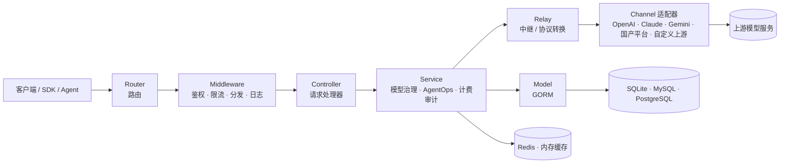

<div align="center">


# MAX API

🍥 **AI 模型治理、AgentOps 与 AGI 应用服务基础设施**

<p align="center">
  <strong>简体中文</strong> |
  <a href="./README.zh_TW.md">繁體中文</a> |
  <a href="./README.en.md">English</a> |
  <a href="./README.fr.md">Français</a> |
  <a href="./README.ja.md">日本語</a>
</p>

<p align="center">
  <a href="https://raw.githubusercontent.com/MAX-API-Next/MAX-API/main/LICENSE">
    
  </a><!--
  --><a href="https://github.com/MAX-API-Next/MAX-API/releases/latest">
    
  </a><!--
  --><a href="https://hub.docker.com/r/cscitechtop/max-api">
    
  </a><!--
  --><a href="https://goreportcard.com/report/github.com/MAX-API-Next/MAX-API">
    
  </a>
</p>

<p align="center">
  <a href="#-项目定位">项目定位</a> •
  <a href="#-发布渠道">发布渠道</a> •
  <a href="#-治理框架">治理框架</a> •
  <a href="#-适用场景">适用场景</a> •
  <a href="#-快速开始">快速开始</a> •
  <a href="#-核心能力">核心能力</a> •
  <a href="#-治理配置">治理配置</a> •
  <a href="#-架构概览">架构概览</a> •
  <a href="#-ai-模型与接口支持">模型与接口</a> •
  <a href="#-部署">部署</a> •
  <a href="#-常见问题">FAQ</a> •
  <a href="#-许可证">许可证</a>
</p>

</div>

---

## 📝 项目说明

MAX API 是由来自科研机构和高校的 AGI 爱好者组织发起、维护和长期运营的 AI 模型治理、AgentOps 与应用服务基础设施项目，面向开发者、研究者、团队和组织提供稳定、可复用的服务层能力。项目关注 AI 应用落地后的持续运营问题：模型越来越多、供应商接口频繁变化、Agent 调用链路变长、成本和审计压力增加。MAX API 在应用、Agent、用户、组织和上游模型服务之间提供统一的接入、鉴权、路由、计费、观测和治理层，让 AI 应用更稳定、更可控地运行。

换句话说，MAX API 不只是请求转发器，而是面向 AI-ready 应用和 Agent 工作负载的可运营网关：在统一模型协议与供应商差异的同时，把突发流量、长流式响应、大请求体、多节点缓存、成本审计和性能观测放进同一套治理边界。

持续投入方向：

- **AI 模型治理**：持续跟踪 OpenAI、Azure OpenAI、AWS Bedrock、Vertex AI、Ollama，以及 DeepSeek、通义千问 / 阿里云百炼、智谱 GLM、Kimi、豆包 / 火山引擎、腾讯混元、百度文心 / 千帆、讯飞星火、MiniMax、零一万物、硅基流动等模型与平台的模型更新、接口变化、参数差异、价格规则和任务协议；同时关注 Dify、RAGFlow、Kling、Seedance 等应用和多模态生态的接入形态，通过渠道、模型映射、协议转换、路径覆盖和可配置任务协议，把分散模型能力纳入统一治理。
- **AI Agent 治理 / AgentOps**：围绕 Agent、工作流和工具调用场景，持续完善令牌治理、模型访问控制、调用追踪、成本归因、异常定位和日志审计，并为后续 MCP 风格工具 / 服务接入预留统一治理边界，帮助 Agent 应用在真实业务中更可观测、更可运营。
- **渠道配置治理**：在渠道新建和编辑界面提供渠道能力矩阵与配置校验，直观展示 `chat/completions`、`responses`、`embeddings`、`rerank`、`video tasks`、模型发现等能力，并提前提示 Base URL、JSON 配置、Vertex AI 区域、Codex 凭证、视频任务占位符等常见配置风险。
- **运营优化与成本治理**：持续优化渠道路由、失败重试、限流、预扣费、失败退款、日志观测、成本统计和运维分析；文本与多模态 token 场景可使用表达式计费和统一 JSON 配置，视频等异步任务场景可使用参数化 rate-card，让模型成本和 Agent 调用成本更直观、可核算、可批量维护。

> [!IMPORTANT]
> - 面向公众提供生成式人工智能服务时，使用者应遵守[《生成式人工智能服务管理暂行办法》](http://www.cac.gov.cn/2023-07/13/c_1690898327029107.htm)等监管要求，并自行完成所在司法辖区要求的备案、许可、内容安全、实名、日志留存、税务、支付和上游授权等合规义务。
> - 日志审计、内容留存等敏感能力应仅在具备合法依据、明确告知、权限隔离和数据安全措施的场景下启用。
> - MAX API 提供模型与 Agent 工作负载的网关治理层，不提供上游模型账号、密钥、基础模型训练能力，也不替代 Dify、LangChain、MCP Server 等 Agent 编排或应用开发框架。

---

## 🚦 发布渠道

MAX API 当前版本发布分为正式版和 Preview 预览版。Preview 预览版用于提前开放新能力和修复，便于社区与部署者在真实环境中验证兼容性、稳定性和安全性；正式版会在对应 Preview 预览版稳定运行 1 周后发布，以降低生产环境升级风险，保障系统安全性和可靠性。

生产环境建议优先使用正式版；需要提前验证新功能、修复或兼容性变化时，可在测试环境或灰度环境使用 Preview 预览版，并在升级前做好数据库备份和回滚预案。

---

## 🎯 项目定位

在 AGI 应用时代，MAX API 聚焦于开放的 AI 模型治理和 AI Agent 治理基础设施，建设让开发者和组织能够稳定运行 AI 应用与 Agent 工作负载的服务、治理和运营层：

- **模型治理平面**：统一管理模型入口、渠道、供应商、协议格式、模型映射、价格规则、任务协议和多模态接口。
- **AgentOps 控制平面**：不替代 Agent 编排框架，而是在网关层为 Agent 工作负载提供令牌治理、模型访问控制、调用日志、成本追踪、异常定位和运营分析。
- **渠道配置平面**：通过能力矩阵、表单校验、模型发现和协议模板，降低新增上游渠道、迁移供应商和维护非标准接口时的误配置风险。
- **协议与供应商适配层**：持续跟踪海外官方接口、国产模型平台接口（DeepSeek、通义、智谱、火山引擎、百度千帆等）以及各类 OpenAI 兼容 / 非标准接口的变化，并规范化为稳定的应用侧接口。
- **成本、额度与可靠性治理**：支持渠道路由、加权分发、失败重试、限流、预扣费、失败退款，以及表达式计费、固定价格、任务 rate-card、倍率计费和用量统计。
- **性能与可扩展性治理**：通过 Redis / 内存缓存、模型请求限流、流式超时与大响应缓冲、请求体上限、磁盘缓存、Pyroscope 性能采样和优雅关闭，支撑单机到多节点部署的稳定运行。
- **组织级运营与审计层**：为团队、研究机构、企业和社区服务提供用户管理、分组管理、私有化部署、数据留存、审计和持续运营优化能力。
- **可复用治理模板**：沉淀渠道模板、任务协议模板、价格配置、部署实践和运维经验，降低新模型、新供应商和新 Agent 场景的接入成本。

---

## 🧠 治理框架

MAX API 的设计把 AI 模型和 AI Agent 的运行过程纳入可配置、可观测、可核算、可审计的治理框架。

| 治理对象 | MAX API 提供的能力 | 目标 |
|----------|-------------------|------|
| 模型资产 | 模型列表、模型映射、模型分组、模型限制、价格规则和多模态接口管理 | 让组织知道“有哪些模型、谁能用、怎么计费、如何切换” |
| 上游渠道 | 供应商渠道、权重、分组、状态、密钥、Base URL、路径覆盖、能力矩阵、配置校验、模型发现和失败重试 | 降低单一供应商不可用、涨价、限流、误配置或接口变化带来的风险 |
| 协议格式 | OpenAI Compatible、Responses、Claude Messages、Gemini、Realtime、通用视频任务协议等协议入口和转换 | 让应用侧尽量面对稳定接口，而不是直接承担各家协议差异 |
| Agent 令牌 | API Key、令牌分组、模型范围、额度限制、过期时间和访问控制 | 为 Agent、工作流和工具调用分配独立、可回收、可限额的访问凭据 |
| 用量与成本 | 请求日志、用量统计、表达式计费、分阶段计费 JSON、任务 rate-card、预扣费和失败退款 | 把模型调用成本拆到用户、分组、令牌、模型、渠道和节点维度 |
| 异步任务 | 视频等任务提交、轮询、状态映射、结果代理和任务计费 | 统一治理长耗时、多状态、多上游格式的多模态任务 |
| 审计与安全 | 管理员侧日志审计、错误日志、请求限制、流式超时、登录与权限控制 | 在私有化部署和合规场景中提供可控的审计边界，敏感内容审计集中放在安全与限制中管理 |
| 组织运营 | 用户、分组、余额、支付、系统设置、数据看板和运维配置 | 支撑团队、研究机构、企业或社区服务的持续运营 |

---

## 🧩 适用场景

- **组织内部 AI 模型治理平台**：统一管理用户、令牌、模型、渠道、分组、权限、价格和账单，避免每个团队重复接入和维护上游服务。
- **Agent 应用运行与治理底座**：为 Agent、工作流和工具调用应用提供稳定的模型网关、令牌隔离、成本控制、调用观测、异常定位和审计基础。
- **国产模型与多供应商适配中心**：持续跟踪国内外模型平台接口和价格变化，通过渠道配置、模型映射、路径覆盖和协议模板降低适配成本。
- **多模态任务治理平台**：统一接入文本、图像、视频、音频、嵌入、重排序、实时对话等接口，并对异步任务做状态、结果代理和计费治理。
- **模型成本与 Agent 成本核算平台**：围绕用户、令牌、模型、渠道和分组进行额度分配、费用核算、账单统计和成本分析。
- **私有化与合规运营环境**：适合需要自主管理密钥、数据、权限、日志、审计和计费策略的团队或机构。

---

## 🚀 快速开始

默认使用 SQLite，本地体验无需额外数据库。

> [!WARNING]
> SQLite 仅适合本地体验、开发和小规模测试。正式/生产环境不建议使用 SQLite：在并发请求、多实例部署、大量日志与用量数据、数据库迁移、备份恢复或长事务场景下，可能出现锁等待、写入阻塞、迁移耗时或失败，以及可用性和数据维护问题。正式环境请使用 MySQL ≥ 5.7.8 或 PostgreSQL ≥ 9.6，并配置可靠的备份与恢复方案。

```bash
# 1. 拉取镜像
docker pull cscitechtop/max-api:latest

# 2. 启动服务，数据持久化到当前目录 ./data
docker run --name max-api -d --restart always \
  -p 3000:3000 \
  -e TZ=Asia/Shanghai \
  -v ./data:/data \
  cscitechtop/max-api:latest

# 3. 访问控制台
# 浏览器打开 http://localhost:3000
```

生产部署建议使用 Docker Compose，并显式配置数据库、Redis、会话密钥、加密密钥和日志目录。

```bash
git clone https://github.com/MAX-API-Next/MAX-API.git
cd MAX-API

# 按需修改 docker-compose.yml 中的数据库、Redis 密码和环境变量
docker compose up -d
```

> [!WARNING]
> 将本项目作为面向公众的生成式 AI 服务或 API 服务运营时，应先完成上游授权、备案、内容安全、实名、日志留存、税务、支付和用户协议等合规事项。

---

## ✨ 核心能力

### AI 模型治理

| 能力 | 说明 |
|------|------|
| 统一模型入口 | 支持 OpenAI 兼容接口、Responses、Claude Messages、Gemini、Realtime 等多种协议入口，应用侧可通过统一网关访问模型 |
| 多供应商模型池 | 海外可接入 OpenAI、Azure、Claude、Gemini、AWS Bedrock、Vertex AI、Ollama；国产方向持续跟踪并内置 DeepSeek、通义千问、智谱 GLM、Kimi、豆包、腾讯混元、文心、讯飞星火、MiniMax、零一万物、硅基流动等渠道适配 |
| 上游生态适配 | 支持 Codex、Dify、RAGFlow、Kling、Seedance 等应用、Agent 和多模态平台相关接口的接入治理，便于把模型调用、工作流调用和异步任务纳入统一网关 |
| 模型映射与访问范围 | 支持按渠道配置模型列表、模型映射、用户分组、令牌分组和模型限制，让不同团队、应用或 Agent 使用不同模型集合 |
| 渠道能力矩阵 | 渠道编辑界面展示 `chat/completions`、`responses`、`Claude Messages`、`Gemini native`、`embeddings`、`images`、`audio`、`rerank`、`video tasks`、`model discovery` 等能力状态，减少管理员对渠道能力的猜测 |
| 渠道配置校验 | 在保存前检查 API Key、模型列表、Base URL、额外配置、JSON 对象、Vertex AI 区域、Codex 凭证、模型发现能力和视频任务路径占位符等常见问题 |
| 多模态模型治理 | 支持聊天、图像、视频、音频、嵌入、重排序、实时对话等场景，并对视频等异步任务提供提交、轮询、状态映射和结果代理 |
| 通用视频任务协议 | 支持将不同视频上游的任务提交、查询、进度、状态映射、错误消息和结果 URL 路径统一配置到渠道中；请求体透传和改写复用渠道设置，默认路径为 `/v1/videos/create` 与 `/v1/videos/{task_id}` |
| 协议转换与自定义上游 | 支持 OpenAI Compatible、Responses、Chat Completions、Claude Messages、Gemini 等格式之间的转换与适配，也支持配置合法授权的上游地址、路径覆盖和任务协议解析规则 |

### AI Agent 治理 / AgentOps

| 能力 | 说明 |
|------|------|
| Agent 令牌隔离 | 可为 Agent、工作流、插件、工具调用或用户创建独立 API Key，并配置模型范围、额度、过期时间和分组 |
| 模型访问控制 | 通过用户、令牌、分组、模型限制和渠道策略控制 Agent 能调用哪些模型、走哪些渠道、消耗多少额度 |
| 调用链路观测 | 提供请求日志、用量统计、渠道命中、耗时、错误和重试信息，帮助定位 Agent 调用失败、成本异常和上游波动 |
| 成本归因 | 支持按模型、渠道、用户、分组、令牌和节点维度统计成本与用量，方便核算不同 Agent、业务线或部署节点成本 |
| 管理员审计 | 私有部署场景可按合规要求启用管理员侧日志审计能力，普通用户日志接口会过滤管理员专用审计字段 |
| 运营看板 | 提供面向管理员的统计分析、用户管理、渠道管理、系统设置和运维分析能力 |

### 成本、计费与可靠性治理

**模型价格表达式**

- **一行表达式 = 一个 token 模型的完整计价规则**：阶梯定价、缓存命中、图像 / 音频 token 分项、分时折扣、按请求头或参数动态加价，全部写在同一行，适合维护复杂模型价格。
- **价格即真实价格**：系数直接填写「美元 / 百万 token」，`p * 2.5` 就是输入每百万 token 2.5 美元，适合按上游价格表维护成本；传统倍率模式仍保持兼容。
- **可视化 + 原始双模式编辑**：既可逐项填价格、按档位设条件，也可直接编辑表达式，并内置常见模型预设模板。
- **统一 JSON 批量维护**：支持在一个 `Tiered billing JSON` 窗口中维护多个模型的分阶段计费规则，保存时原子更新 `billing_mode` 与 `billing_expr`，避免手动维护多个配置项时出现不同步。
- **自动 token 归一**：按上游格式（OpenAI / Claude）和表达式实际用到的变量，自动从输入/输出中剥离缓存、图像、音频等子类别，避免重复计费；日志中可还原命中的计价档位与明细。

**任务计费、传统计费与可靠性**

- 支持视频等异步任务的参数化 rate-card 计费，按模型、供应商、时长、质量、音频、视频输入等字段匹配单价；可通过 `task_billing_setting.rate_cards` 的 JSON 窗口统一维护，并用 `vendor` 字段区分 Sora、Veo、Seedance、Kling 等供应商分区。
- 兼容按量、按次、缓存命中等计费模式，以及模型倍率、分组倍率、渠道倍率。
- 支持预扣费、失败退款、异常处理和消费日志，适合长耗时 Agent 调用链路和异步多模态任务。
- 支持渠道加权随机、失败重试、禁用渠道绕过和模型级路由，降低上游异常对应用和 Agent 的影响。
- 支持 Redis 缓存与内存缓存，适配单机和多机部署。

### 性能与可扩展性治理

| 能力 | 说明 |
|------|------|
| 缓存与多节点扩展 | 单机可使用内存缓存，多机可接入 Redis；用户、令牌、渠道亲和、额度相关缓存减少重复数据库访问，并通过 `SESSION_SECRET`、`CRYPTO_SECRET`、`NODE_NAME` 保持会话、加密和日志归属一致 |
| 请求限流与容量保护 | 支持全局 API / Web 限流、关键接口限流、搜索限流、模型请求限流和按分组配置的模型请求配额；可使用 Redis 或内存计数器 |
| 流式与大请求控制 | 支持 `STREAMING_TIMEOUT`、`STREAM_SCANNER_MAX_BUFFER_MB`、`MAX_REQUEST_BODY_MB`、`MAX_FILE_DOWNLOAD_MB` 等配置，控制长流式响应、大行 SSE、解压后请求体和远程文件下载大小 |
| 中继连接调优 | 支持 `RELAY_TIMEOUT`、`RELAY_IDLE_CONN_TIMEOUT`、`RELAY_MAX_IDLE_CONNS`、`RELAY_MAX_IDLE_CONNS_PER_HOST` 配置上游 HTTP 连接池与超时策略 |
| 磁盘缓存与性能观测 | 系统性能设置可启用大请求体磁盘缓存、配置缓存阈值和容量；运维接口可查看 / 清理磁盘缓存，并可通过 Pyroscope 采集 CPU、内存、goroutine、mutex 和 block profile |
| 平滑退出与数据落盘 | 关闭进程时支持 `SHUTDOWN_TIMEOUT_SECONDS` 和 `QUOTA_DATA_CACHE_SAVE_TIMEOUT_SECONDS`，尽量在退出前完成 HTTP 关闭和额度缓存保存 |

### 安全与组织管理

- 支持 JWT、WebAuthn/Passkeys、OAuth、OIDC、Telegram、Discord、LinuxDO 等登录方式。
- 支持管理员、普通用户、分组、令牌和模型访问控制。
- 支持请求体大小限制、流式超时控制、错误日志和运行状态检查。
- 支持多机部署下的统一会话密钥、加密密钥和 Redis 共享缓存。

---

## 🆚 为什么使用网关

| 维度 | 直连各家官方 SDK / API | 通过 MAX API 网关 |
|------|------------------------|-------------------|
| 模型接入 | 每家一套 SDK、鉴权和参数 | 统一模型入口，一次接入，多模型复用 |
| 模型治理 | 模型清单、价格、权限和渠道分散在各平台 | 统一管理模型、渠道、映射、分组、额度和价格规则 |
| Agent 访问 | Agent 直接持有上游 Key，难以回收和限额 | 为 Agent 分配独立令牌，并限制模型、额度、过期时间和分组 |
| 协议差异 | 应用自行适配 Claude、Gemini、Responses 等格式 | 网关统一做协议转换和供应商适配 |
| 失败处理 | 应用自行实现重试、降级和错误归一 | 渠道失败自动重试、加权路由和错误处理 |
| 性能与扩展 | 应用自行处理超时、限流、连接池和缓存 | 网关集中提供流式超时、请求限制、Redis / 内存缓存、连接池调优和性能观测 |
| 成本统计 | 各平台账单分散，难以按用户或 Agent 核算 | 统一额度、计费、用量统计和消费日志，可按令牌和模型归因 |
| 审计边界 | 应用侧分散记录，权限和留存策略不统一 | 管理员侧统一审计入口，普通用户日志过滤管理员专用字段 |
| 私有化 | 密钥、日志和计费策略分散 | 自托管，自主掌控密钥、数据、日志和策略 |

---

## 🧭 架构概览

MAX API 采用分层架构：应用、SDK 或 Agent 请求经统一入口进入，依次经过路由、中间件、控制器和业务服务层，最终由中继层适配到对应上游供应商；数据层和缓存层为模型治理、Agent 令牌治理、计费、日志、审计和任务状态提供持久化与加速能力。



### 目录结构

| 目录 | 职责 |
|------|------|
| `router/` | HTTP 路由，包含 API、relay、dashboard 和 web 入口 |
| `controller/` | 请求处理器，负责参数解析、鉴权后的业务入口和响应封装 |
| `service/` | 业务逻辑，包含模型治理、AgentOps、日志、计费、审计、任务、渠道和系统配置等能力 |
| `model/` | 数据模型与数据库访问，基于 GORM 兼容 SQLite、MySQL、PostgreSQL |
| `relay/` | AI API 中继、协议转换和供应商适配 |
| `relay/channel/` | 各供应商适配器，如 openai、claude、gemini、aws 等 |
| `middleware/` | 鉴权、限流、CORS、日志、请求分发和上下文处理 |
| `setting/` | 模型价格、任务计费、运营、系统、安全和性能配置 |
| `common/` | JSON、加密、Redis、限流、环境变量等共享工具 |
| `dto/` / `types/` | 请求、响应、错误和中继格式类型定义 |
| `constant/` | API 类型、渠道类型、上下文键等常量 |
| `i18n/` / `oauth/` / `pkg/` | 后端国际化、OAuth 实现和内部包 |
| `web/` | 前端主题容器，默认主题位于 `web/default/` |

### 技术栈

| 层 | 技术 |
|------|------|
| 后端 | Go 1.25+、Gin、GORM v2 |
| 前端 | React 19、TypeScript、Rsbuild、Base UI、Tailwind CSS |
| 包管理 | Bun workspace |
| 数据库 | SQLite / MySQL ≥ 5.7.8 / PostgreSQL ≥ 9.6 |
| 缓存 | Redis + 内存缓存 |
| 鉴权 | JWT、WebAuthn/Passkeys、OAuth、OIDC |

---

## 🤖 AI 模型与接口支持

> 实际可用模型取决于你的上游授权、渠道配置、模型映射和服务商支持情况。MAX API 的重点是把这些模型能力纳入统一治理，而不是提供上游模型服务本身。

| 类型 | 说明 |
|------|------|
| OpenAI-Compatible | Chat Completions、Embeddings、Images、Audio 等兼容接口，可作为多数应用和 Agent 的通用模型入口 |
| OpenAI Responses | Responses 格式请求、中继与 Responses ↔ Chat Completions 兼容转换，适合逐步接入新的 OpenAI 应用协议 |
| Claude Messages | Claude Messages 格式与 OpenAI 兼容格式转换，降低应用侧多协议维护成本 |
| Google Gemini | Gemini 聊天、文本，以及 `/v1/responses` 兼容转换能力 |
| Azure OpenAI | Azure OpenAI 与 Realtime 相关接口 |
| AWS Bedrock | Bedrock Runtime 相关模型接入 |
| 上游平台和应用生态 | AWS、Azure、Vertex、Ollama、Codex、Dify、RAGFlow、Kling、Seedance 等平台或应用形态可按渠道能力接入治理 |
| 国产模型与平台 | 内置 DeepSeek、通义千问 / 阿里云百炼、智谱 GLM、Kimi、豆包 / 火山引擎、腾讯混元、百度文心 / 千帆、讯飞星火、MiniMax、零一万物、硅基流动等适配器或兼容接入能力 |
| `rerank` | Cohere、Jina 等重排序模型，可用于检索增强和 Agent 检索链路 |
| Midjourney / Suno / Dify | 图像、音乐、工作流等服务适配 |
| 视频任务接口 | 支持 `/v1/videos/create`、`/v1/videos/{task_id}` 等视频生成任务的提交、请求体透传或参数覆盖、轮询、状态映射、结果代理和参数化任务计费 |
| 自定义上游 | 支持配置合法授权的上游接口地址、协议适配规则、Responses / Chat 转换、路径覆盖、状态映射、错误消息路径和任务结果解析 |

### 支持的主要接口

<details>
<summary>查看接口类别</summary>

- 聊天接口：`/v1/chat/completions`
- 响应接口：`/v1/responses`
- 图像接口：`/v1/images/*`
- 音频接口：`/v1/audio/*`
- 视频接口：`/v1/videos/*`
- 嵌入接口：`/v1/embeddings`
- 重排序接口：`/v1/rerank`
- 实时对话：OpenAI Realtime 兼容接口
- Claude Messages：Claude 原生格式入口
- Gemini：Google Gemini 格式入口

</details>

### Reasoning Effort 支持

<details>
<summary>查看示例模型命名</summary>

**OpenAI 系列：**

- `o3-mini-high`
- `o3-mini-medium`
- `o3-mini-low`
- `gpt-5-high`
- `gpt-5-medium`
- `gpt-5-low`

**Claude 思考模型：**

- `claude-3-7-sonnet-20250219-thinking`

**Gemini 系列：**

- `gemini-2.5-flash-thinking`
- `gemini-2.5-flash-nothinking`
- `gemini-2.5-pro-thinking`
- `gemini-2.5-pro-thinking-128`
- 也可以在 Gemini 模型名后追加 `-low`、`-medium`、`-high` 来控制思考力度。

</details>

---

## 🔧 治理配置

### 初始治理配置建议

1. 部署完成后进入控制台，创建或确认管理员账号。
2. 配置系统设置、用户注册策略、登录方式和安全限制。
3. 添加上游渠道，填写合法授权的 API Key、Base URL、模型列表、模型映射和渠道设置。
4. 根据组织结构配置用户分组、令牌分组、模型限制、额度策略和价格规则，将模型能力纳入访问控制。
5. 为应用、Agent 或工作流创建独立令牌，按业务线、环境或风险级别配置模型范围和额度。
6. 在运营设置中配置失败重试、日志记录、缓存策略和消费统计。
7. 如需管理员侧内容审计，应在合规前提下进入“系统设置 → 安全与限制 → 日志审计”启用，并确保“记录配额使用量（日志维护）”已开启。

### 渠道能力矩阵与配置校验

渠道新建或编辑时，系统会根据渠道类型展示能力矩阵，并给出实时配置校验结果。矩阵中的接口名称保留原始技术表述，例如 `chat/completions`、`responses`、`embeddings`、`rerank`、`video tasks`，说明文字使用中文，便于管理员判断当前渠道能承担哪些模型和任务。

配置校验覆盖以下常见问题：

- 新建渠道缺少 API Key、模型列表为空、需要 Base URL 或额外配置但未填写。
- Base URL 误填到 `/v1` 结尾，导致系统再次拼接上游路径。
- `setting`、`param_override`、`header_override`、`settings` 等字段不是 JSON 对象。
- Vertex AI 区域配置缺少 `default`，或服务账号密钥不是有效 JSON。
- Codex 渠道凭证缺少 `access_token` 或 `account_id`。
- 当前渠道不支持模型发现，但开启了上游模型检查或自动同步。
- 视频任务查询路径缺少 `{task_id}`、`{operation_name}` 或 `{upstream_task_id}` 占位符。

### 通用视频任务协议

视频模型供应商的接口经常在路径、任务 ID、状态字段、进度字段、错误字段和结果 URL 字段上不一致。MAX API 将原先面向单一模型的任务协议能力扩展为通用视频任务协议，适用于 OpenAI、Ali、Gemini、MiniMax、Vertex AI、VolcEngine、Kling、Jimeng、Vidu、Doubao Video、Sora 等视频任务渠道。

支持的配置层级：

- **仅路径覆盖**：只配置 `submit_path` 和 `query_path`，系统仍使用对应渠道的官方响应解析逻辑，适合只改上游路径的兼容渠道。
- **完整协议解析**：设置 `task_protocol = "generic_video_task"`，同时配置任务 ID、状态、进度、结果 URL、错误消息和状态映射路径，适合非标准视频任务响应。
- **请求体处理**：通用视频任务协议不再单独定义请求体生成模式。需要原样透传客户端 JSON 时使用渠道设置里的 `Pass Through Body`；需要字段改写、默认值或 header 联动时使用已有的 `Param Override`。

默认任务路径：

```json
{
  "task_protocol": "generic_video_task",
  "task_protocol_config": {
    "submit_path": "/v1/videos/create",
    "query_path": "/v1/videos/{task_id}",
    "task_id_path": "task_id",
    "status_path": "status",
    "progress_path": "progress",
    "result_url_paths": [
      "result.primary_url",
      "result.urls.0",
      "data.result.primary_url",
      "url",
      "video_url",
      "download_url"
    ],
    "error_message_path": "error_message",
    "status_map": {
      "queued": "QUEUED",
      "running": "IN_PROGRESS",
      "succeeded": "SUCCESS",
      "failed": "FAILURE"
    }
  }
}
```

查询路径支持 `{task_id}`、`{operation_name}`、`{upstream_task_id}`。其中 `{operation_name}` 可保留多段路径值，适合 Gemini / Vertex 风格的 operation 查询接口。视频内容可通过 `/v1/videos/{task_id}/content` 代理读取；在需要隐藏上游资源域名的部署中，建议让终端用户访问该内容代理地址，并配合鉴权、SSRF 防护和允许端口配置使用。

### 计费 JSON 维护

系统设置中的模型计费支持两类 JSON 统一维护入口：

- **分阶段计费 JSON**：通过 `Tiered billing JSON` 统一维护多个模型的 `{ enabled, expr }` 配置，保存时同步更新 `billing_mode` 与 `billing_expr`。
- **任务 rate-card JSON**：通过 `task_billing_setting.rate_cards` 统一维护异步任务计费规则，可按 `vendor` 分区维护 Sora、Veo、Seedance、Kling 等视频模型的不同计费表。

Seedance 2.0 等视频模型可按分辨率、视频输入等请求参数参与倍率或 rate-card 计算；使用透传或参数覆盖时，应确保最终提交给上游的字段与计费字段保持一致。

示例结构：

```json
{
  "model-name": {
    "enabled": true,
    "expr": "len <= 200000 ? tier(\"standard\", p * 3 + c * 15) : tier(\"long_context\", p * 6 + c * 22.5)"
  }
}
```

任务 rate-card 可按请求参数匹配价格：

```json
{
  "vendor/model-name": {
    "vendor": "kling",
    "unit": "second",
    "quantity_field": "duration",
    "default_quantity": 5,
    "strict": true,
    "defaults": {
      "quality": "std",
      "has_audio": "false"
    },
    "rows": [
      {
        "id": "std_no_audio",
        "match": {
          "quality": "std",
          "has_audio": "false"
        },
        "unit_price": 0.6
      }
    ]
  }
}
```

### 常见运维入口

| 功能 | 说明 |
|------|------|
| 渠道管理 | 配置上游供应商、模型映射、渠道权重、密钥、协议路径和状态，并通过能力矩阵与配置校验提前发现风险 |
| 模型与价格 | 维护模型列表、模型价格、表达式计费、分阶段计费 JSON、任务 rate-card JSON 和模型展示信息 |
| 令牌管理 | 为应用、Agent、工作流、工具调用或用户创建访问令牌并限制模型与额度 |
| 用户管理 | 管理用户、分组、余额、权限和状态 |
| 使用日志 | 查看调用记录、消耗、耗时、错误、渠道命中和管理员可见的审计信息 |
| 系统设置 | 管理安全限制、日志审计、模型定价、任务计费、运营策略、日志维护、支付和站点配置 |
| 数据看板 | 查看整体请求量、模型用量、消费趋势、渠道状态和 Agent 令牌成本 |

---

## 🚢 部署

### 部署要求

| 组件 | 要求 |
|------|------|
| 容器引擎 | Docker / Docker Compose |
| 本地数据库 | SQLite，仅用于本地体验、开发或小规模测试；Docker 部署时需挂载 `/data` |
| 正式环境数据库 | MySQL ≥ 5.7.8 或 PostgreSQL ≥ 9.6，并配置可靠的备份与恢复方案 |
| 缓存 | 单机可使用内存缓存，多机部署建议使用 Redis |
| 前端构建 | 使用 Bun workspace，需保留 `web/package.json` 与 `web/bun.lock` |
| 源码构建 | 使用仓库 `go.mod` 声明的 Go 版本（当前 Go 1.25.1+）和 `go.sum`；依赖或安全更新后运行 `go mod download`、`go mod verify` 并重新构建 |

### 推荐环境变量

<details>
<summary>查看常用环境变量</summary>

| 变量名 | 说明 | 默认值 |
|--------|------|--------|
| `SESSION_SECRET` | 会话密钥，多机部署必须设置 | - |
| `CRYPTO_SECRET` | 加密密钥，使用 Redis 或多机部署时必须设置 | - |
| `SQL_DSN` | 数据库连接字符串 | - |
| `REDIS_CONN_STRING` | Redis 连接字符串 | - |
| `STREAMING_TIMEOUT` | 流式响应超时时间，单位秒 | `300` |
| `STREAM_SCANNER_MAX_BUFFER_MB` | 流式扫描器单行最大缓冲，图像 base64 等大响应可适当调大 | `64` |
| `MAX_REQUEST_BODY_MB` | 请求体最大大小，按解压后大小计算，超出返回 `413` | `32` |
| `AZURE_DEFAULT_API_VERSION` | Azure API 默认版本 | `2025-04-01-preview` |
| `ERROR_LOG_ENABLED` | 错误日志开关 | `false` |
| `NODE_NAME` | 节点名称，多机部署时用于日志定位和异步任务结算归属 | - |
| `PYROSCOPE_URL` | Pyroscope 服务地址 | - |
| `PYROSCOPE_APP_NAME` | Pyroscope 应用名 | `max-api` |
| `PYROSCOPE_BASIC_AUTH_USER` | Pyroscope Basic Auth 用户名 | - |
| `PYROSCOPE_BASIC_AUTH_PASSWORD` | Pyroscope Basic Auth 密码 | - |
| `PYROSCOPE_MUTEX_RATE` | Pyroscope mutex 采样率 | `5` |
| `PYROSCOPE_BLOCK_RATE` | Pyroscope block 采样率 | `5` |
| `HOSTNAME` | Pyroscope 标签中的主机名 | `max-api` |

</details>

### Docker Compose

```bash
git clone https://github.com/MAX-API-Next/MAX-API.git
cd MAX-API

# 修改 docker-compose.yml：
# - 更换 PostgreSQL / MySQL / Redis 默认密码
# - 按需设置 SESSION_SECRET、CRYPTO_SECRET、NODE_NAME
# - 生产环境建议配置反向代理与 HTTPS
docker compose up -d
```

### Docker 命令

**SQLite：**

```bash
docker run --name max-api -d --restart always \
  -p 3000:3000 \
  -e TZ=Asia/Shanghai \
  -v ./data:/data \
  cscitechtop/max-api:latest
```

**MySQL：**

```bash
docker run --name max-api -d --restart always \
  -p 3000:3000 \
  -e SQL_DSN="root:123456@tcp(mysql:3306)/max-api" \
  -e TZ=Asia/Shanghai \
  -v ./data:/data \
  cscitechtop/max-api:latest
```

### 从源码构建镜像

```bash
git clone https://github.com/MAX-API-Next/MAX-API.git
cd MAX-API
docker build -t cscitechtop/max-api:latest .
```

> [!NOTE]
> `Dockerfile` 会在镜像构建中下载 Go 模块。宿主机直接构建或依赖 / 安全更新后，请保持 `go.mod` 与 `go.sum` 成对提交，先运行 `go mod download && go mod verify`，再重新构建二进制或镜像；需要刷新基础镜像时可使用 `docker build --pull --no-cache -t cscitechtop/max-api:latest .`。

> [!TIP]
> 前端使用 Bun workspace。构建上下文中必须保留 `web/package.json`、`web/bun.lock` 和 `web/default/package.json`，否则 `catalog:` 依赖无法解析。

### 多机部署注意事项

> [!WARNING]
> - 必须设置相同的 `SESSION_SECRET`，否则不同节点之间登录状态不一致。
> - 使用共享 Redis 时必须设置相同的 `CRYPTO_SECRET`，否则加密数据无法解密。
> - 多节点建议设置稳定的 `NODE_NAME`，便于在日志、审计信息和异步任务结算中定位来源节点。
> - 生产环境应使用外部数据库、外部 Redis、HTTPS 反向代理和可靠的备份策略。

---

## 🗺️ 路线图

以下为方向性规划，会根据维护节奏、真实场景和社区需求调整，不构成时间承诺。

- **模型治理深化**：围绕模型目录、模型价格、模型权限、模型映射、模型能力标签和供应商变更，持续增强治理能力。
- **AgentOps 深化**：围绕 Agent、工具调用、工作流和 MCP 风格工具 / 服务接入，持续优化调用链路、成本归因、异常定位和治理能力。
- **多模态任务治理**：增强图像、视频、音频和实时交互任务的计费、限流、状态追踪和结果代理。
- **协议转换增强**：持续完善 OpenAI Compatible、Responses、Claude Messages、Gemini 等协议之间的转换。
- **国产模型与平台跟踪适配**：跟进国产模型、云平台、价格规则和 API 协议变化，沉淀可复用的渠道、价格和任务协议配置。
- **供应商适配模板化**：让路径覆盖、任务协议、状态映射、错误解析和结果解析更容易配置和复用。
- **治理审计与运营优化**：完善请求链路、成本追踪、错误分析、管理员审计、日志留存和运维报表。
- **组织级运营能力**：增强多租户、分组、账单、权限、风控和私有化部署体验。

欢迎在 [GitHub Issues](https://github.com/MAX-API-Next/MAX-API/issues) 提出需求、问题和改进建议。

---

## ❓ 常见问题

<details>
<summary><strong>MAX API 会提供模型服务或 API Key 吗？</strong></summary>

不会。MAX API 是模型与 Agent 工作负载的网关治理层，不提供上游模型账号、API Key、基础模型训练能力或模型服务本身。使用者需要自行获得合法授权的上游服务。

</details>

<details>
<summary><strong>MAX API 和 Agent 框架是什么关系？</strong></summary>

MAX API 不替代 Dify、LangChain、MCP Server、工作流引擎或业务 Agent 应用。它位于这些应用与上游模型服务之间，负责模型接入、令牌隔离、成本核算、路由容灾、日志观测和管理员审计等治理能力。

</details>

<details>
<summary><strong>为什么强调 AI 模型治理？</strong></summary>

在真实组织中，模型不只是一个 API 名称，还涉及供应商、价格、上下文长度、协议格式、权限范围、稳定性和审计边界。MAX API 的价值在于把这些分散变量统一配置、统一观察和统一核算。

</details>

<details>
<summary><strong>支持哪些数据库？</strong></summary>

支持 SQLite、MySQL ≥ 5.7.8 和 PostgreSQL ≥ 9.6。本地体验可使用 SQLite；生产环境建议使用 MySQL 或 PostgreSQL，并做好备份。

</details>

<details>
<summary><strong>能否从 New API / One API 迁移？</strong></summary>

项目兼容 New API 与原版 One API 的主要数据结构，通常可以复用既有数据。迁移前仍建议备份数据库，并在测试环境验证渠道、倍率、用户、令牌和日志数据。

</details>

<details>
<summary><strong>多机部署需要注意什么？</strong></summary>

必须统一 `SESSION_SECRET`。如果使用共享 Redis，也必须统一 `CRYPTO_SECRET`。否则可能出现登录状态不一致、缓存数据无法解密或任务状态异常。

</details>

<details>
<summary><strong>图像生成、流式响应或大响应被截断怎么办？</strong></summary>

可调大 `STREAM_SCANNER_MAX_BUFFER_MB`。4K 图像、base64 图片、长流式响应等场景可能需要更大的扫描缓冲。

</details>

<details>
<summary><strong>请求体过大返回 413 怎么办？</strong></summary>

调整 `MAX_REQUEST_BODY_MB`。该限制按解压后的请求体大小计算，用于防止超大请求或 zip bomb 导致内存暴涨。

</details>

<details>
<summary><strong>用户能看到管理员日志审计中的输入输出内容吗？</strong></summary>

正常用户日志接口会过滤管理员专用字段，普通用户无法在自助使用日志中看到管理员审计内容。数据库管理员、系统管理员或拥有管理员日志接口权限的人仍可能访问相关数据，因此应按合规要求严格控制权限。

</details>

<details>
<summary><strong>为什么 Docker 构建时提示 `catalog:` 依赖无法解析？</strong></summary>

前端使用 Bun workspace，`catalog:` 依赖定义在 `web/package.json`。构建时不能用 `web/default/package.json` 覆盖 workspace 根 `package.json`，并且需要保留 `web/bun.lock`。

</details>

---

## 🔗 相关项目

| 项目 | 说明 |
|------|------|
| [One API](https://github.com/songquanpeng/one-api) | MIT 协议 |
| [New API](https://github.com/QuantumNous/new-api) | AGPLv3 协议 |
| [Midjourney-Proxy](https://github.com/novicezk/midjourney-proxy) | Apache-2.0 协议 |
| [Suno API](https://github.com/Suno-API/Suno-API) | MIT 协议 |

### 配套工具

| 项目 | 说明 |
|------|------|
| [max-api-key-tool](https://github.com/MAX-API-Next/MAX-API-key-tool) | Key 额度查询工具 |
| [max-api-horizon](https://github.com/MAX-API-Next/MAX-API-horizon) | MAX API 高性能优化版 |

---

## 📚 文档与支持

| 资源 | 链接 |
|------|------|
| 官方文档 | [MAX-API-Next/MAX-API](https://github.com/MAX-API-Next/MAX-API) |
| 问题反馈 | [GitHub Issues](https://github.com/MAX-API-Next/MAX-API/issues) |
| 最新发布 | [Releases](https://github.com/MAX-API-Next/MAX-API/releases) |
| DeepWiki | [Ask DeepWiki](https://deepwiki.com/MAX-API-Next/MAX-API) |

### 二次开发与社区鸣谢

如果你基于本项目进行二次开发并仅供自用，欢迎在项目主页、页脚或“关于”页面等明显位置，任选一种方式保留项目来源或社区鸣谢：

- 添加项目地址：[MAX-API-Next/MAX-API](https://github.com/MAX-API-Next/MAX-API)
- 鸣谢社区：[MAX-API-Next](https://github.com/MAX-API-Next)

参考前端嵌入代码（React / Tailwind CSS，可按需保留其中一项）：

```tsx
<p className='text-sm text-muted-foreground'>
  基于{' '}
  <a
    href='https://github.com/MAX-API-Next/MAX-API'
    target='_blank'
    rel='noopener noreferrer'
    className='font-medium underline underline-offset-4'
  >
    MAX-API-Next/MAX-API
  </a>{' '}
  二次开发 · 感谢{' '}
  <a
    href='https://github.com/MAX-API-Next'
    target='_blank'
    rel='noopener noreferrer'
    className='font-medium underline underline-offset-4'
  >
    MAX-API-Next 社区
  </a>
</p>
```

满足上述任一展示要求并保持链接清晰可见，即自动获得本项目的临时商用授权，无需另行申请或等待确认。该授权为非永久授权，仅在持续满足展示要求期间有效；有效期及后续调整以项目方在本 README 或官方社区发布的最新说明为准。

本项目基于 [One API](https://github.com/songquanpeng/one-api) 和 [New API](https://github.com/QuantumNous/new-api) 开发。现阶段，MAX API 主要在上述项目基础上持续增强 AI API 网关与治理能力、扩展功能并修复问题。商业使用本项目时，还须分别遵守 One API 的 MIT 许可证与 New API 的 AGPLv3 许可证，具体以各上游项目的 `LICENSE` 文件为准；本项目提供的临时商用授权不替代、也不免除相关上游项目的开源许可义务。

如不再满足展示要求，或临时授权到期、被公告调整或终止，仍需按 AGPLv3 或项目方另行书面授权使用本项目。如需长期商用授权，请联系：maxapi@max-api.ai。

欢迎提交 Issue、改进文档、补充供应商适配经验、完善部署方案或贡献代码。

---

## 📜 许可证

本项目采用 [GNU Affero 通用公共许可证 v3.0 (AGPLv3)](./LICENSE) 授权。

除默认的 AGPLv3 授权外，符合上文“二次开发与社区鸣谢”条件的自用二开项目，可按该说明自动获得非永久的临时商用授权。该临时授权仅覆盖 MAX API 项目方有权授权的新增与修改部分，并不包含或代替 One API、New API 等上游项目的许可授权。

如果你修改并通过网络向用户提供本项目服务，请理解并遵守 AGPLv3 对应源码提供等义务。商业合作、机构合作或其他授权问题，请联系：maxapi@max-api.ai。

---

## 🌟 Star History

<div align="center">

[](https://star-history.com/#MAX-API-Next/MAX-API&Date)

</div>

---

<div align="center">

### 💖 感谢使用 MAX API

如果这个项目对你有帮助，欢迎给我们一个 ⭐ Star。

**[官方文档](https://github.com/MAX-API-Next/MAX-API)** • **[问题反馈](https://github.com/MAX-API-Next/MAX-API/issues)** • **[最新发布](https://github.com/MAX-API-Next/MAX-API/releases)**

<sub>Built with ❤️ by MAX-API-Next</sub>

</div>
