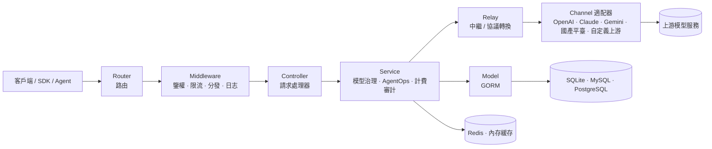

<div align="center">


# MAX API

🍥 **AI 模型治理、AgentOps 與 AGI 應用服務基礎設施**

<p align="center">
  <a href="./README.zh_CN.md">簡體中文</a> |
  <strong>繁體中文</strong> |
  <a href="./README.en.md">English</a> |
  <a href="./README.fr.md">Français</a> |
  <a href="./README.ja.md">日本語</a>
</p>

<p align="center">
  <a href="https://raw.githubusercontent.com/MAX-API-Next/MAX-API/main/LICENSE">
    
  </a><!--
  --><a href="https://github.com/MAX-API-Next/MAX-API/releases/latest">
    
  </a><!--
  --><a href="https://hub.docker.com/r/cscitechtop/max-api">
    
  </a><!--
  --><a href="https://goreportcard.com/report/github.com/MAX-API-Next/MAX-API">
    
  </a>
</p>

<p align="center">
  <a href="#-專案定位">專案定位</a> •
  <a href="#-發布渠道">發布渠道</a> •
  <a href="#-治理框架">治理框架</a> •
  <a href="#-適用場景">適用場景</a> •
  <a href="#-快速開始">快速開始</a> •
  <a href="#-核心能力">核心能力</a> •
  <a href="#-治理配置">治理配置</a> •
  <a href="#-架構概覽">架構概覽</a> •
  <a href="#-ai-模型與介面支持">模型與介面</a> •
  <a href="#-部署">部署</a> •
  <a href="#-常見問題">FAQ</a> •
  <a href="#-許可證">許可證</a>
</p>

</div>

---

## 📝 專案說明

MAX API 是由來自科研機構和高校的 AGI 愛好者組織發起、維護和長期營運的 AI 模型治理、AgentOps 與應用服務基礎設施專案，面向開發者、研究者、團隊和組織提供穩定、可復用的服務層能力。專案關注 AI 應用落地后的持續營運問題：模型越來越多、供應商介面頻繁變化、Agent 調用鏈路變長、成本和審計壓力增加。MAX API 在應用、Agent、使用者、組織和上游模型服務之間提供統一的接入、鑒權、路由、計費、觀測和治理層，讓 AI 應用更穩定、更可控地運行。

換句話說，MAX API 不只是請求轉發器，而是面向 AI-ready 應用和 Agent 工作負載的可營運網關：在統一模型協議與供應商差異的同時，把突發流量、長流式響應、大請求體、多節點緩存、成本審計和性能觀測放進同一套治理邊界。

持續投入方向：

- **AI 模型治理**：持續跟蹤 OpenAI、Azure OpenAI、AWS Bedrock、Vertex AI、Ollama，以及 DeepSeek、通義千問 / 阿里云百煉、智譜 GLM、Kimi、豆包 / 火山引擎、騰訊混元、百度文心 / 千帆、訊飛星火、MiniMax、零一萬物、硅基流動等模型與平臺的模型更新、介面變化、參數差異、價格規則和任務協議；同時關注 Dify、RAGFlow、Kling、Seedance 等應用和多模態生態的接入形態，通過渠道、模型映射、協議轉換、路徑覆蓋和可配置任務協議，把分散模型能力納入統一治理。
- **AI Agent 治理 / AgentOps**：圍繞 Agent、工作流和工具調用場景，持續完善令牌治理、模型訪問控制、調用追蹤、成本歸因、異常定位和日志審計，并為后續 MCP 風格工具 / 服務接入預留統一治理邊界，幫助 Agent 應用在真實業務中更可觀測、更可營運。
- **渠道配置治理**：在渠道新建和編輯界面提供渠道能力矩陣與配置校驗，直觀展示 `chat/completions`、`responses`、`embeddings`、`rerank`、`video tasks`、模型發現等能力，并提前提示 Base URL、JSON 配置、Vertex AI 區域、Codex 憑證、視頻任務占位符等常見配置風險。
- **營運優化與成本治理**：持續優化渠道路由、失敗重試、限流、預扣費、失敗退款、日志觀測、成本統計和運維分析；文本與多模態 token 場景可使用表達式計費和統一 JSON 配置，視頻等異步任務場景可使用參數化 rate-card，讓模型成本和 Agent 調用成本更直觀、可核算、可批量維護。

> [!IMPORTANT]
> - 面向公眾提供生成式人工智能服務時，使用者應遵守[《生成式人工智能服務管理暫行辦法》](http://www.cac.gov.cn/2023-07/13/c_1690898327029107.htm)等監管要求，并自行完成所在司法轄區要求的備案、許可、內容安全、實名、日志留存、稅務、支付和上游授權等合規義務。
> - 日志審計、內容留存等敏感能力應僅在具備合法依據、明確告知、權限隔離和資料安全措施的場景下啟用。
> - MAX API 提供模型與 Agent 工作負載的網關治理層，不提供上游模型賬號、密鑰、基礎模型訓練能力，也不替代 Dify、LangChain、MCP Server 等 Agent 編排或應用開發框架。

---

## 🚦 發布渠道

MAX API 當前版本發布分為正式版和 Preview 預覽版。Preview 預覽版用於提前開放新能力和修復，便於社群與部署者在真實環境中驗證相容性、穩定性和安全性；正式版會在對應 Preview 預覽版穩定運行 1 週後發布，以降低生產環境升級風險，保障系統安全性和可靠性。

生產環境建議優先使用正式版；需要提前驗證新功能、修復或相容性變化時，可在測試環境或灰度環境使用 Preview 預覽版，並在升級前做好資料庫備份和回滾預案。

---

## 🎯 專案定位

在 AGI 應用時代，MAX API 聚焦于開放的 AI 模型治理和 AI Agent 治理基礎設施，建設讓開發者和組織能夠穩定運行 AI 應用與 Agent 工作負載的服務、治理和營運層：

- **模型治理平面**：統一管理模型入口、渠道、供應商、協議格式、模型映射、價格規則、任務協議和多模態介面。
- **AgentOps 控制平面**：不替代 Agent 編排框架，而是在網關層為 Agent 工作負載提供令牌治理、模型訪問控制、調用日志、成本追蹤、異常定位和營運分析。
- **渠道配置平面**：通過能力矩陣、表單校驗、模型發現和協議模板，降低新增上游渠道、遷移供應商和維護非標準介面時的誤配置風險。
- **協議與供應商適配層**：持續跟蹤海外官方介面、國產模型平臺介面（DeepSeek、通義、智譜、火山引擎、百度千帆等）以及各類 OpenAI 兼容 / 非標準介面的變化，并規范化為穩定的應用側介面。
- **成本、額度與可靠性治理**：支持渠道路由、加權分發、失敗重試、限流、預扣費、失敗退款，以及表達式計費、固定價格、任務 rate-card、倍率計費和用量統計。
- **性能與可擴展性治理**：通過 Redis / 內存緩存、模型請求限流、流式超時與大響應緩衝、請求體上限、磁盤緩存、Pyroscope 性能采樣和優雅關閉，支撐單機到多節點部署的穩定運行。
- **組織級營運與審計層**：為團隊、研究機構、企業和社區服務提供使用者管理、分組管理、私有化部署、資料留存、審計和持續營運優化能力。
- **可復用治理模板**：沉淀渠道模板、任務協議模板、價格配置、部署實踐和運維經驗，降低新模型、新供應商和新 Agent 場景的接入成本。

---

## 🧠 治理框架

MAX API 的設計把 AI 模型和 AI Agent 的運行過程納入可配置、可觀測、可核算、可審計的治理框架。

| 治理對象 | MAX API 提供的能力 | 目標 |
|----------|-------------------|------|
| 模型資產 | 模型列表、模型映射、模型分組、模型限制、價格規則和多模態介面管理 | 讓組織知道“有哪些模型、誰能用、怎么計費、如何切換” |
| 上游渠道 | 供應商渠道、權重、分組、狀態、密鑰、Base URL、路徑覆蓋、能力矩陣、配置校驗、模型發現和失敗重試 | 降低單一供應商不可用、漲價、限流、誤配置或介面變化帶來的風險 |
| 協議格式 | OpenAI Compatible、Responses、Claude Messages、Gemini、Realtime、通用視頻任務協議等協議入口和轉換 | 讓應用側盡量面對穩定介面，而不是直接承擔各家協議差異 |
| Agent 令牌 | API Key、令牌分組、模型范圍、額度限制、過期時間和訪問控制 | 為 Agent、工作流和工具調用分配獨立、可回收、可限額的訪問憑據 |
| 用量與成本 | 請求日志、用量統計、表達式計費、分階段計費 JSON、任務 rate-card、預扣費和失敗退款 | 把模型調用成本拆到使用者、分組、令牌、模型、渠道和節點維度 |
| 異步任務 | 視頻等任務提交、輪詢、狀態映射、結果代理和任務計費 | 統一治理長耗時、多狀態、多上游格式的多模態任務 |
| 審計與安全 | 管理員側日志審計、錯誤日志、請求限制、流式超時、登錄與權限控制 | 在私有化部署和合規場景中提供可控的審計邊界，敏感內容審計集中放在安全與限制中管理 |
| 組織營運 | 使用者、分組、余額、支付、系統設置、資料看板和運維配置 | 支撐團隊、研究機構、企業或社區服務的持續營運 |

---

## 🧩 適用場景

- **組織內部 AI 模型治理平臺**：統一管理使用者、令牌、模型、渠道、分組、權限、價格和賬單，避免每個團隊重復接入和維護上游服務。
- **Agent 應用運行與治理底座**：為 Agent、工作流和工具調用應用提供穩定的模型網關、令牌隔離、成本控制、調用觀測、異常定位和審計基礎。
- **國產模型與多供應商適配中心**：持續跟蹤國內外模型平臺介面和價格變化，通過渠道配置、模型映射、路徑覆蓋和協議模板降低適配成本。
- **多模態任務治理平臺**：統一接入文本、圖像、視頻、音頻、嵌入、重排序、實時對話等介面，并對異步任務做狀態、結果代理和計費治理。
- **模型成本與 Agent 成本核算平臺**：圍繞使用者、令牌、模型、渠道和分組進行額度分配、費用核算、賬單統計和成本分析。
- **私有化與合規營運環境**：適合需要自主管理密鑰、資料、權限、日志、審計和計費策略的團隊或機構。

---

## 🚀 快速開始

默認使用 SQLite，本地體驗無需額外資料庫。

> [!WARNING]
> SQLite 僅適合本地體驗、開發和小規模測試。正式／生產環境不建議使用 SQLite：在併發請求、多實例部署、大量日志與用量資料、資料庫遷移、備份恢復或長事務場景下，可能出現鎖等待、寫入阻塞、遷移耗時或失敗，以及可用性和資料維護問題。正式環境請使用 MySQL ≥ 5.7.8 或 PostgreSQL ≥ 9.6，並配置可靠的備份與恢復方案。

```bash
# 1. 拉取鏡像
docker pull cscitechtop/max-api:latest

# 2. 啟動服務，資料持久化到當前目錄 ./data
docker run --name max-api -d --restart always \
  -p 3000:3000 \
  -e TZ=Asia/Shanghai \
  -v ./data:/data \
  cscitechtop/max-api:latest

# 3. 訪問控制臺
# 瀏覽器打開 http://localhost:3000
```

生產部署建議使用 Docker Compose，并顯式配置資料庫、Redis、會話密鑰、加密密鑰和日志目錄。

```bash
git clone https://github.com/MAX-API-Next/MAX-API.git
cd MAX-API

# 按需修改 docker-compose.yml 中的資料庫、Redis 密碼和環境變量
docker compose up -d
```

> [!WARNING]
> 將本專案作為面向公眾的生成式 AI 服務或 API 服務營運時，應先完成上游授權、備案、內容安全、實名、日志留存、稅務、支付和使用者協議等合規事項。

---

## ✨ 核心能力

### AI 模型治理

| 能力 | 說明 |
|------|------|
| 統一模型入口 | 支持 OpenAI 兼容介面、Responses、Claude Messages、Gemini、Realtime 等多種協議入口，應用側可通過統一網關訪問模型 |
| 多供應商模型池 | 海外可接入 OpenAI、Azure、Claude、Gemini、AWS Bedrock、Vertex AI、Ollama；國產方向持續跟蹤并內置 DeepSeek、通義千問、智譜 GLM、Kimi、豆包、騰訊混元、文心、訊飛星火、MiniMax、零一萬物、硅基流動等渠道適配 |
| 上游生態適配 | 支持 Codex、Dify、RAGFlow、Kling、Seedance 等應用、Agent 和多模態平臺相關介面的接入治理，便于把模型調用、工作流調用和異步任務納入統一網關 |
| 模型映射與訪問范圍 | 支持按渠道配置模型列表、模型映射、使用者分組、令牌分組和模型限制，讓不同團隊、應用或 Agent 使用不同模型集合 |
| 渠道能力矩陣 | 渠道編輯界面展示 `chat/completions`、`responses`、`Claude Messages`、`Gemini native`、`embeddings`、`images`、`audio`、`rerank`、`video tasks`、`model discovery` 等能力狀態，減少管理員對渠道能力的猜測 |
| 渠道配置校驗 | 在保存前檢查 API Key、模型列表、Base URL、額外配置、JSON 對象、Vertex AI 區域、Codex 憑證、模型發現能力和視頻任務路徑占位符等常見問題 |
| 多模態模型治理 | 支持聊天、圖像、視頻、音頻、嵌入、重排序、實時對話等場景，并對視頻等異步任務提供提交、輪詢、狀態映射和結果代理 |
| 通用視頻任務協議 | 支持將不同視頻上游的任務提交、查詢、進度、狀態映射、錯誤消息和結果 URL 路徑統一配置到渠道中；請求體透傳和改寫復用渠道設置，默認路徑為 `/v1/videos/create` 與 `/v1/videos/{task_id}` |
| 協議轉換與自定義上游 | 支持 OpenAI Compatible、Responses、Chat Completions、Claude Messages、Gemini 等格式之間的轉換與適配，也支持配置合法授權的上游地址、路徑覆蓋和任務協議解析規則 |

### AI Agent 治理 / AgentOps

| 能力 | 說明 |
|------|------|
| Agent 令牌隔離 | 可為 Agent、工作流、插件、工具調用或使用者創建獨立 API Key，并配置模型范圍、額度、過期時間和分組 |
| 模型訪問控制 | 通過使用者、令牌、分組、模型限制和渠道策略控制 Agent 能調用哪些模型、走哪些渠道、消耗多少額度 |
| 調用鏈路觀測 | 提供請求日志、用量統計、渠道命中、耗時、錯誤和重試信息，幫助定位 Agent 調用失敗、成本異常和上游波動 |
| 成本歸因 | 支持按模型、渠道、使用者、分組、令牌和節點維度統計成本與用量，方便核算不同 Agent、業務線或部署節點成本 |
| 管理員審計 | 私有部署場景可按合規要求啟用管理員側日志審計能力，普通使用者日志介面會過濾管理員專用審計字段 |
| 營運看板 | 提供面向管理員的統計分析、使用者管理、渠道管理、系統設置和運維分析能力 |

### 成本、計費與可靠性治理

**模型價格表達式**

- **一行表達式 = 一個 token 模型的完整計價規則**：階梯定價、緩存命中、圖像 / 音頻 token 分項、分時折扣、按請求頭或參數動態加價，全部寫在同一行，適合維護復雜模型價格。
- **價格即真實價格**：系數直接填寫「美元 / 百萬 token」，`p * 2.5` 就是輸入每百萬 token 2.5 美元，適合按上游價格表維護成本；傳統倍率模式仍保持兼容。
- **可視化 + 原始雙模式編輯**：既可逐項填價格、按檔位設條件，也可直接編輯表達式，并內置常見模型預設模板。
- **統一 JSON 批量維護**：支持在一個 `Tiered billing JSON` 窗口中維護多個模型的分階段計費規則，保存時原子更新 `billing_mode` 與 `billing_expr`，避免手動維護多個配置項時出現不同步。
- **自動 token 歸一**：按上游格式（OpenAI / Claude）和表達式實際用到的變量，自動從輸入/輸出中剝離緩存、圖像、音頻等子類別，避免重復計費；日志中可還原命中的計價檔位與明細。

**任務計費、傳統計費與可靠性**

- 支持視頻等異步任務的參數化 rate-card 計費，按模型、供應商、時長、質量、音頻、視頻輸入等字段匹配單價；可通過 `task_billing_setting.rate_cards` 的 JSON 窗口統一維護，并用 `vendor` 字段區分 Sora、Veo、Seedance、Kling 等供應商分區。
- 兼容按量、按次、緩存命中等計費模式，以及模型倍率、分組倍率、渠道倍率。
- 支持預扣費、失敗退款、異常處理和消費日志，適合長耗時 Agent 調用鏈路和異步多模態任務。
- 支持渠道加權隨機、失敗重試、禁用渠道繞過和模型級路由，降低上游異常對應用和 Agent 的影響。
- 支持 Redis 緩存與內存緩存，適配單機和多機部署。

### 性能與可擴展性治理

| 能力 | 說明 |
|------|------|
| 緩存與多節點擴展 | 單機可使用內存緩存，多機可接入 Redis；使用者、令牌、渠道親和、額度相關緩存減少重復資料庫訪問，并通過 `SESSION_SECRET`、`CRYPTO_SECRET`、`NODE_NAME` 保持會話、加密和日志歸屬一致 |
| 請求限流與容量保護 | 支持全局 API / Web 限流、關鍵介面限流、搜索限流、模型請求限流和按分組配置的模型請求配額；可使用 Redis 或內存計數器 |
| 流式與大請求控制 | 支持 `STREAMING_TIMEOUT`、`STREAM_SCANNER_MAX_BUFFER_MB`、`MAX_REQUEST_BODY_MB`、`MAX_FILE_DOWNLOAD_MB` 等配置，控制長流式響應、大行 SSE、解壓后請求體和遠程文件下載大小 |
| 中繼連接調優 | 支持 `RELAY_TIMEOUT`、`RELAY_IDLE_CONN_TIMEOUT`、`RELAY_MAX_IDLE_CONNS`、`RELAY_MAX_IDLE_CONNS_PER_HOST` 配置上游 HTTP 連接池與超時策略 |
| 磁盤緩存與性能觀測 | 系統性能設置可啟用大請求體磁盤緩存、配置緩存閾值和容量；運維介面可查看 / 清理磁盤緩存，并可通過 Pyroscope 采集 CPU、內存、goroutine、mutex 和 block profile |
| 平滑退出與資料落盤 | 關閉進程時支持 `SHUTDOWN_TIMEOUT_SECONDS` 和 `QUOTA_DATA_CACHE_SAVE_TIMEOUT_SECONDS`，盡量在退出前完成 HTTP 關閉和額度緩存保存 |

### 安全與組織管理

- 支持 JWT、WebAuthn/Passkeys、OAuth、OIDC、Telegram、Discord、LinuxDO 等登錄方式。
- 支持管理員、普通使用者、分組、令牌和模型訪問控制。
- 支持請求體大小限制、流式超時控制、錯誤日志和運行狀態檢查。
- 支持多機部署下的統一會話密鑰、加密密鑰和 Redis 共享緩存。

---

## 🆚 為什麼使用網關

| 維度 | 直連各家官方 SDK / API | 通過 MAX API 網關 |
|------|------------------------|-------------------|
| 模型接入 | 每家一套 SDK、鑒權和參數 | 統一模型入口，一次接入，多模型復用 |
| 模型治理 | 模型清單、價格、權限和渠道分散在各平臺 | 統一管理模型、渠道、映射、分組、額度和價格規則 |
| Agent 訪問 | Agent 直接持有上游 Key，難以回收和限額 | 為 Agent 分配獨立令牌，并限制模型、額度、過期時間和分組 |
| 協議差異 | 應用自行適配 Claude、Gemini、Responses 等格式 | 網關統一做協議轉換和供應商適配 |
| 失敗處理 | 應用自行實現重試、降級和錯誤歸一 | 渠道失敗自動重試、加權路由和錯誤處理 |
| 性能與擴展 | 應用自行處理超時、限流、連接池和緩存 | 網關集中提供流式超時、請求限制、Redis / 內存緩存、連接池調優和性能觀測 |
| 成本統計 | 各平臺賬單分散，難以按使用者或 Agent 核算 | 統一額度、計費、用量統計和消費日志，可按令牌和模型歸因 |
| 審計邊界 | 應用側分散記錄，權限和留存策略不統一 | 管理員側統一審計入口，普通使用者日志過濾管理員專用字段 |
| 私有化 | 密鑰、日志和計費策略分散 | 自托管，自主掌控密鑰、資料、日志和策略 |

---

## 🧭 架構概覽

MAX API 采用分層架構：應用、SDK 或 Agent 請求經統一入口進入，依次經過路由、中間件、控制器和業務服務層，最終由中繼層適配到對應上游供應商；資料層和緩存層為模型治理、Agent 令牌治理、計費、日志、審計和任務狀態提供持久化與加速能力。



### 目錄結構

| 目錄 | 職責 |
|------|------|
| `router/` | HTTP 路由，包含 API、relay、dashboard 和 web 入口 |
| `controller/` | 請求處理器，負責參數解析、鑒權后的業務入口和響應封裝 |
| `service/` | 業務邏輯，包含模型治理、AgentOps、日志、計費、審計、任務、渠道和系統配置等能力 |
| `model/` | 資料模型與資料庫訪問，基于 GORM 兼容 SQLite、MySQL、PostgreSQL |
| `relay/` | AI API 中繼、協議轉換和供應商適配 |
| `relay/channel/` | 各供應商適配器，如 openai、claude、gemini、aws 等 |
| `middleware/` | 鑒權、限流、CORS、日志、請求分發和上下文處理 |
| `setting/` | 模型價格、任務計費、營運、系統、安全和性能配置 |
| `common/` | JSON、加密、Redis、限流、環境變量等共享工具 |
| `dto/` / `types/` | 請求、響應、錯誤和中繼格式類型定義 |
| `constant/` | API 類型、渠道類型、上下文鍵等常量 |
| `i18n/` / `oauth/` / `pkg/` | 后端國際化、OAuth 實現和內部包 |
| `web/` | 前端主題容器，默認主題位于 `web/default/` |

### 技術棧

| 層 | 技術 |
|------|------|
| 后端 | Go 1.25+、Gin、GORM v2 |
| 前端 | React 19、TypeScript、Rsbuild、Base UI、Tailwind CSS |
| 包管理 | Bun workspace |
| 資料庫 | SQLite / MySQL ≥ 5.7.8 / PostgreSQL ≥ 9.6 |
| 緩存 | Redis + 內存緩存 |
| 鑒權 | JWT、WebAuthn/Passkeys、OAuth、OIDC |

---

## 🤖 AI 模型與介面支持

> 實際可用模型取決于你的上游授權、渠道配置、模型映射和服務商支持情況。MAX API 的重點是把這些模型能力納入統一治理，而不是提供上游模型服務本身。

| 類型 | 說明 |
|------|------|
| OpenAI-Compatible | Chat Completions、Embeddings、Images、Audio 等兼容介面，可作為多數應用和 Agent 的通用模型入口 |
| OpenAI Responses | Responses 格式請求、中繼與 Responses ↔ Chat Completions 兼容轉換，適合逐步接入新的 OpenAI 應用協議 |
| Claude Messages | Claude Messages 格式與 OpenAI 兼容格式轉換，降低應用側多協議維護成本 |
| Google Gemini | Gemini 聊天、文本，以及 `/v1/responses` 兼容轉換能力 |
| Azure OpenAI | Azure OpenAI 與 Realtime 相關介面 |
| AWS Bedrock | Bedrock Runtime 相關模型接入 |
| 上游平臺和應用生態 | AWS、Azure、Vertex、Ollama、Codex、Dify、RAGFlow、Kling、Seedance 等平臺或應用形態可按渠道能力接入治理 |
| 國產模型與平臺 | 內置 DeepSeek、通義千問 / 阿里云百煉、智譜 GLM、Kimi、豆包 / 火山引擎、騰訊混元、百度文心 / 千帆、訊飛星火、MiniMax、零一萬物、硅基流動等適配器或兼容接入能力 |
| `rerank` | Cohere、Jina 等重排序模型，可用于檢索增強和 Agent 檢索鏈路 |
| Midjourney / Suno / Dify | 圖像、音樂、工作流等服務適配 |
| 視頻任務介面 | 支持 `/v1/videos/create`、`/v1/videos/{task_id}` 等視頻生成任務的提交、請求體透傳或參數覆蓋、輪詢、狀態映射、結果代理和參數化任務計費 |
| 自定義上游 | 支持配置合法授權的上游介面地址、協議適配規則、Responses / Chat 轉換、路徑覆蓋、狀態映射、錯誤消息路徑和任務結果解析 |

### 支持的主要介面

<details>
<summary>查看介面類別</summary>

- 聊天介面：`/v1/chat/completions`
- 響應介面：`/v1/responses`
- 圖像介面：`/v1/images/*`
- 音頻介面：`/v1/audio/*`
- 視頻介面：`/v1/videos/*`
- 嵌入介面：`/v1/embeddings`
- 重排序介面：`/v1/rerank`
- 實時對話：OpenAI Realtime 兼容介面
- Claude Messages：Claude 原生格式入口
- Gemini：Google Gemini 格式入口

</details>

### Reasoning Effort 支持

<details>
<summary>查看示例模型命名</summary>

**OpenAI 系列：**

- `o3-mini-high`
- `o3-mini-medium`
- `o3-mini-low`
- `gpt-5-high`
- `gpt-5-medium`
- `gpt-5-low`

**Claude 思考模型：**

- `claude-3-7-sonnet-20250219-thinking`

**Gemini 系列：**

- `gemini-2.5-flash-thinking`
- `gemini-2.5-flash-nothinking`
- `gemini-2.5-pro-thinking`
- `gemini-2.5-pro-thinking-128`
- 也可以在 Gemini 模型名后追加 `-low`、`-medium`、`-high` 來控制思考力度。

</details>

---

## 🔧 治理配置

### 初始治理配置建議

1. 部署完成后進入控制臺，創建或確認管理員賬號。
2. 配置系統設置、使用者注冊策略、登錄方式和安全限制。
3. 添加上游渠道，填寫合法授權的 API Key、Base URL、模型列表、模型映射和渠道設置。
4. 根據組織結構配置使用者分組、令牌分組、模型限制、額度策略和價格規則，將模型能力納入訪問控制。
5. 為應用、Agent 或工作流創建獨立令牌，按業務線、環境或風險級別配置模型范圍和額度。
6. 在營運設置中配置失敗重試、日志記錄、緩存策略和消費統計。
7. 如需管理員側內容審計，應在合規前提下進入“系統設置 → 安全與限制 → 日志審計”啟用，并確保“記錄配額使用量（日志維護）”已開啟。

### 渠道能力矩陣與配置校驗

渠道新建或編輯時，系統會根據渠道類型展示能力矩陣，并給出實時配置校驗結果。矩陣中的介面名稱保留原始技術表述，例如 `chat/completions`、`responses`、`embeddings`、`rerank`、`video tasks`，說明文字使用中文，便于管理員判斷當前渠道能承擔哪些模型和任務。

配置校驗覆蓋以下常見問題：

- 新建渠道缺少 API Key、模型列表為空、需要 Base URL 或額外配置但未填寫。
- Base URL 誤填到 `/v1` 結尾，導致系統再次拼接上游路徑。
- `setting`、`param_override`、`header_override`、`settings` 等字段不是 JSON 對象。
- Vertex AI 區域配置缺少 `default`，或服務賬號密鑰不是有效 JSON。
- Codex 渠道憑證缺少 `access_token` 或 `account_id`。
- 當前渠道不支持模型發現，但開啟了上游模型檢查或自動同步。
- 視頻任務查詢路徑缺少 `{task_id}`、`{operation_name}` 或 `{upstream_task_id}` 占位符。

### 通用視頻任務協議

視頻模型供應商的介面經常在路徑、任務 ID、狀態字段、進度字段、錯誤字段和結果 URL 字段上不一致。MAX API 將原先面向單一模型的任務協議能力擴展為通用視頻任務協議，適用于 OpenAI、Ali、Gemini、MiniMax、Vertex AI、VolcEngine、Kling、Jimeng、Vidu、Doubao Video、Sora 等視頻任務渠道。

支持的配置層級：

- **僅路徑覆蓋**：只配置 `submit_path` 和 `query_path`，系統仍使用對應渠道的官方響應解析邏輯，適合只改上游路徑的兼容渠道。
- **完整協議解析**：設置 `task_protocol = "generic_video_task"`，同時配置任務 ID、狀態、進度、結果 URL、錯誤消息和狀態映射路徑，適合非標準視頻任務響應。
- **請求體處理**：通用視頻任務協議不再單獨定義請求體生成模式。需要原樣透傳客戶端 JSON 時使用渠道設置里的 `Pass Through Body`；需要字段改寫、默認值或 header 聯動時使用已有的 `Param Override`。

默認任務路徑：

```json
{
  "task_protocol": "generic_video_task",
  "task_protocol_config": {
    "submit_path": "/v1/videos/create",
    "query_path": "/v1/videos/{task_id}",
    "task_id_path": "task_id",
    "status_path": "status",
    "progress_path": "progress",
    "result_url_paths": [
      "result.primary_url",
      "result.urls.0",
      "data.result.primary_url",
      "url",
      "video_url",
      "download_url"
    ],
    "error_message_path": "error_message",
    "status_map": {
      "queued": "QUEUED",
      "running": "IN_PROGRESS",
      "succeeded": "SUCCESS",
      "failed": "FAILURE"
    }
  }
}
```

查詢路徑支持 `{task_id}`、`{operation_name}`、`{upstream_task_id}`。其中 `{operation_name}` 可保留多段路徑值，適合 Gemini / Vertex 風格的 operation 查詢介面。視頻內容可通過 `/v1/videos/{task_id}/content` 代理讀取；在需要隱藏上游資源域名的部署中，建議讓終端使用者訪問該內容代理地址，并配合鑒權、SSRF 防護和允許端口配置使用。

### 計費 JSON 維護

系統設置中的模型計費支持兩類 JSON 統一維護入口：

- **分階段計費 JSON**：通過 `Tiered billing JSON` 統一維護多個模型的 `{ enabled, expr }` 配置，保存時同步更新 `billing_mode` 與 `billing_expr`。
- **任務 rate-card JSON**：通過 `task_billing_setting.rate_cards` 統一維護異步任務計費規則，可按 `vendor` 分區維護 Sora、Veo、Seedance、Kling 等視頻模型的不同計費表。

Seedance 2.0 等視頻模型可按分辨率、視頻輸入等請求參數參與倍率或 rate-card 計算；使用透傳或參數覆蓋時，應確保最終提交給上游的字段與計費字段保持一致。

示例結構：

```json
{
  "model-name": {
    "enabled": true,
    "expr": "len <= 200000 ? tier(\"standard\", p * 3 + c * 15) : tier(\"long_context\", p * 6 + c * 22.5)"
  }
}
```

任務 rate-card 可按請求參數匹配價格：

```json
{
  "vendor/model-name": {
    "vendor": "kling",
    "unit": "second",
    "quantity_field": "duration",
    "default_quantity": 5,
    "strict": true,
    "defaults": {
      "quality": "std",
      "has_audio": "false"
    },
    "rows": [
      {
        "id": "std_no_audio",
        "match": {
          "quality": "std",
          "has_audio": "false"
        },
        "unit_price": 0.6
      }
    ]
  }
}
```

### 常見運維入口

| 功能 | 說明 |
|------|------|
| 渠道管理 | 配置上游供應商、模型映射、渠道權重、密鑰、協議路徑和狀態，并通過能力矩陣與配置校驗提前發現風險 |
| 模型與價格 | 維護模型列表、模型價格、表達式計費、分階段計費 JSON、任務 rate-card JSON 和模型展示信息 |
| 令牌管理 | 為應用、Agent、工作流、工具調用或使用者創建訪問令牌并限制模型與額度 |
| 使用者管理 | 管理使用者、分組、余額、權限和狀態 |
| 使用日志 | 查看調用記錄、消耗、耗時、錯誤、渠道命中和管理員可見的審計信息 |
| 系統設置 | 管理安全限制、日志審計、模型定價、任務計費、營運策略、日志維護、支付和站點配置 |
| 資料看板 | 查看整體請求量、模型用量、消費趨勢、渠道狀態和 Agent 令牌成本 |

---

## 🚢 部署

### 部署要求

| 組件 | 要求 |
|------|------|
| 容器引擎 | Docker / Docker Compose |
| 本地資料庫 | SQLite，僅用於本地體驗、開發或小規模測試；Docker 部署時需掛載 `/data` |
| 正式環境資料庫 | MySQL ≥ 5.7.8 或 PostgreSQL ≥ 9.6，並配置可靠的備份與恢復方案 |
| 緩存 | 單機可使用內存緩存，多機部署建議使用 Redis |
| 前端構建 | 使用 Bun workspace，需保留 `web/package.json` 與 `web/bun.lock` |
| 源碼構建 | 使用倉庫 `go.mod` 聲明的 Go 版本（目前 Go 1.25.1+）和 `go.sum`；依賴或安全更新後運行 `go mod download`、`go mod verify` 並重新構建 |

### 推薦環境變量

<details>
<summary>查看常用環境變量</summary>

| 變量名 | 說明 | 默認值 |
|--------|------|--------|
| `SESSION_SECRET` | 會話密鑰，多機部署必須設置 | - |
| `CRYPTO_SECRET` | 加密密鑰，使用 Redis 或多機部署時必須設置 | - |
| `SQL_DSN` | 資料庫連接字符串 | - |
| `REDIS_CONN_STRING` | Redis 連接字符串 | - |
| `STREAMING_TIMEOUT` | 流式響應超時時間，單位秒 | `300` |
| `STREAM_SCANNER_MAX_BUFFER_MB` | 流式掃描器單行最大緩沖，圖像 base64 等大響應可適當調大 | `64` |
| `MAX_REQUEST_BODY_MB` | 請求體最大大小，按解壓后大小計算，超出返回 `413` | `32` |
| `AZURE_DEFAULT_API_VERSION` | Azure API 默認版本 | `2025-04-01-preview` |
| `ERROR_LOG_ENABLED` | 錯誤日志開關 | `false` |
| `NODE_NAME` | 節點名稱，多機部署時用于日志定位和異步任務結算歸屬 | - |
| `PYROSCOPE_URL` | Pyroscope 服務地址 | - |
| `PYROSCOPE_APP_NAME` | Pyroscope 應用名 | `max-api` |
| `PYROSCOPE_BASIC_AUTH_USER` | Pyroscope Basic Auth 使用者名 | - |
| `PYROSCOPE_BASIC_AUTH_PASSWORD` | Pyroscope Basic Auth 密碼 | - |
| `PYROSCOPE_MUTEX_RATE` | Pyroscope mutex 采樣率 | `5` |
| `PYROSCOPE_BLOCK_RATE` | Pyroscope block 采樣率 | `5` |
| `HOSTNAME` | Pyroscope 標簽中的主機名 | `max-api` |

</details>

### Docker Compose

```bash
git clone https://github.com/MAX-API-Next/MAX-API.git
cd MAX-API

# 修改 docker-compose.yml：
# - 更換 PostgreSQL / MySQL / Redis 默認密碼
# - 按需設置 SESSION_SECRET、CRYPTO_SECRET、NODE_NAME
# - 生產環境建議配置反向代理與 HTTPS
docker compose up -d
```

### Docker 命令

**SQLite：**

```bash
docker run --name max-api -d --restart always \
  -p 3000:3000 \
  -e TZ=Asia/Shanghai \
  -v ./data:/data \
  cscitechtop/max-api:latest
```

**MySQL：**

```bash
docker run --name max-api -d --restart always \
  -p 3000:3000 \
  -e SQL_DSN="root:123456@tcp(mysql:3306)/max-api" \
  -e TZ=Asia/Shanghai \
  -v ./data:/data \
  cscitechtop/max-api:latest
```

### 從源碼構建鏡像

```bash
git clone https://github.com/MAX-API-Next/MAX-API.git
cd MAX-API
docker build -t cscitechtop/max-api:latest .
```

> [!NOTE]
> `Dockerfile` 會在鏡像構建中下載 Go 模塊。宿主機直接構建或依賴 / 安全更新後，請保持 `go.mod` 與 `go.sum` 成對提交，先運行 `go mod download && go mod verify`，再重新構建二進制或鏡像；需要刷新基礎鏡像時可使用 `docker build --pull --no-cache -t cscitechtop/max-api:latest .`。

> [!TIP]
> 前端使用 Bun workspace。構建上下文中必須保留 `web/package.json`、`web/bun.lock` 和 `web/default/package.json`，否則 `catalog:` 依賴無法解析。

### 多機部署注意事項

> [!WARNING]
> - 必須設置相同的 `SESSION_SECRET`，否則不同節點之間登錄狀態不一致。
> - 使用共享 Redis 時必須設置相同的 `CRYPTO_SECRET`，否則加密資料無法解密。
> - 多節點建議設置穩定的 `NODE_NAME`，便于在日志、審計信息和異步任務結算中定位來源節點。
> - 生產環境應使用外部資料庫、外部 Redis、HTTPS 反向代理和可靠的備份策略。

---

## 🗺️ 路線圖

以下為方向性規劃，會根據維護節奏、真實場景和社區需求調整，不構成時間承諾。

- **模型治理深化**：圍繞模型目錄、模型價格、模型權限、模型映射、模型能力標簽和供應商變更，持續增強治理能力。
- **AgentOps 深化**：圍繞 Agent、工具調用、工作流和 MCP 風格工具 / 服務接入，持續優化調用鏈路、成本歸因、異常定位和治理能力。
- **多模態任務治理**：增強圖像、視頻、音頻和實時交互任務的計費、限流、狀態追蹤和結果代理。
- **協議轉換增強**：持續完善 OpenAI Compatible、Responses、Claude Messages、Gemini 等協議之間的轉換。
- **國產模型與平臺跟蹤適配**：跟進國產模型、云平臺、價格規則和 API 協議變化，沉淀可復用的渠道、價格和任務協議配置。
- **供應商適配模板化**：讓路徑覆蓋、任務協議、狀態映射、錯誤解析和結果解析更容易配置和復用。
- **治理審計與營運優化**：完善請求鏈路、成本追蹤、錯誤分析、管理員審計、日志留存和運維報表。
- **組織級營運能力**：增強多租戶、分組、賬單、權限、風控和私有化部署體驗。

歡迎在 [GitHub Issues](https://github.com/MAX-API-Next/MAX-API/issues) 提出需求、問題和改進建議。

---

## ❓ 常見問題

<details>
<summary><strong>MAX API 會提供模型服務或 API Key 嗎？</strong></summary>

不會。MAX API 是模型與 Agent 工作負載的網關治理層，不提供上游模型賬號、API Key、基礎模型訓練能力或模型服務本身。使用者需要自行獲得合法授權的上游服務。

</details>

<details>
<summary><strong>MAX API 和 Agent 框架是什么關系？</strong></summary>

MAX API 不替代 Dify、LangChain、MCP Server、工作流引擎或業務 Agent 應用。它位于這些應用與上游模型服務之間，負責模型接入、令牌隔離、成本核算、路由容災、日志觀測和管理員審計等治理能力。

</details>

<details>
<summary><strong>為什麼強調 AI 模型治理？</strong></summary>

在真實組織中，模型不只是一個 API 名稱，還涉及供應商、價格、上下文長度、協議格式、權限范圍、穩定性和審計邊界。MAX API 的價值在于把這些分散變量統一配置、統一觀察和統一核算。

</details>

<details>
<summary><strong>支持哪些資料庫？</strong></summary>

支持 SQLite、MySQL ≥ 5.7.8 和 PostgreSQL ≥ 9.6。本地體驗可使用 SQLite；生產環境建議使用 MySQL 或 PostgreSQL，并做好備份。

</details>

<details>
<summary><strong>能否從 New API / One API 遷移？</strong></summary>

專案兼容 New API 與原版 One API 的主要資料結構，通常可以復用既有資料。遷移前仍建議備份資料庫，并在測試環境驗證渠道、倍率、使用者、令牌和日志資料。

</details>

<details>
<summary><strong>多機部署需要注意什么？</strong></summary>

必須統一 `SESSION_SECRET`。如果使用共享 Redis，也必須統一 `CRYPTO_SECRET`。否則可能出現登錄狀態不一致、緩存資料無法解密或任務狀態異常。

</details>

<details>
<summary><strong>圖像生成、流式響應或大響應被截斷怎么辦？</strong></summary>

可調大 `STREAM_SCANNER_MAX_BUFFER_MB`。4K 圖像、base64 圖片、長流式響應等場景可能需要更大的掃描緩沖。

</details>

<details>
<summary><strong>請求體過大返回 413 怎么辦？</strong></summary>

調整 `MAX_REQUEST_BODY_MB`。該限制按解壓后的請求體大小計算，用于防止超大請求或 zip bomb 導致內存暴漲。

</details>

<details>
<summary><strong>使用者能看到管理員日志審計中的輸入輸出內容嗎？</strong></summary>

正常使用者日志介面會過濾管理員專用字段，普通使用者無法在自助使用日志中看到管理員審計內容。資料庫管理員、系統管理員或擁有管理員日志介面權限的人仍可能訪問相關資料，因此應按合規要求嚴格控制權限。

</details>

<details>
<summary><strong>為什麼 Docker 構建時提示 `catalog:` 依賴無法解析？</strong></summary>

前端使用 Bun workspace，`catalog:` 依賴定義在 `web/package.json`。構建時不能用 `web/default/package.json` 覆蓋 workspace 根 `package.json`，并且需要保留 `web/bun.lock`。

</details>

---

## 🔗 相關專案

| 專案 | 說明 |
|------|------|
| [One API](https://github.com/songquanpeng/one-api) | MIT 協議 |
| [New API](https://github.com/QuantumNous/new-api) | AGPLv3 協議 |
| [Midjourney-Proxy](https://github.com/novicezk/midjourney-proxy) | Apache-2.0 協議 |
| [Suno API](https://github.com/Suno-API/Suno-API) | MIT 協議 |

### 配套工具

| 專案 | 說明 |
|------|------|
| [max-api-key-tool](https://github.com/MAX-API-Next/MAX-API-key-tool) | Key 額度查詢工具 |
| [max-api-horizon](https://github.com/MAX-API-Next/MAX-API-horizon) | MAX API 高性能優化版 |

---

## 📚 文檔與支持

| 資源 | 鏈接 |
|------|------|
| 官方文檔 | [MAX-API-Next/MAX-API](https://github.com/MAX-API-Next/MAX-API) |
| 問題反饋 | [GitHub Issues](https://github.com/MAX-API-Next/MAX-API/issues) |
| 最新發布 | [Releases](https://github.com/MAX-API-Next/MAX-API/releases) |
| DeepWiki | [Ask DeepWiki](https://deepwiki.com/MAX-API-Next/MAX-API) |

### 二次開發與社群鳴謝

如果你基於本專案進行二次開發且僅供自用，歡迎在專案首頁、頁尾或「關於」頁面等明顯位置，任選一種方式保留專案來源或社群鳴謝：

- 加入專案網址：[MAX-API-Next/MAX-API](https://github.com/MAX-API-Next/MAX-API)
- 鳴謝社群：[MAX-API-Next](https://github.com/MAX-API-Next)

參考前端嵌入程式碼（React / Tailwind CSS，可按需保留其中一項）：

```tsx
<p className='text-sm text-muted-foreground'>
  基於{' '}
  <a
    href='https://github.com/MAX-API-Next/MAX-API'
    target='_blank'
    rel='noopener noreferrer'
    className='font-medium underline underline-offset-4'
  >
    MAX-API-Next/MAX-API
  </a>{' '}
  二次開發 · 感謝{' '}
  <a
    href='https://github.com/MAX-API-Next'
    target='_blank'
    rel='noopener noreferrer'
    className='font-medium underline underline-offset-4'
  >
    MAX-API-Next 社群
  </a>
</p>
```

滿足上述任一展示要求並保持連結清晰可見，即自動獲得本專案的臨時商用授權，無需另行申請或等待確認。該授權為非永久授權，僅在持續滿足展示要求期間有效；有效期及後續調整以專案方在本 README 或官方社群發布的最新說明為準。

本專案基於 [One API](https://github.com/songquanpeng/one-api) 和 [New API](https://github.com/QuantumNous/new-api) 開發。現階段，MAX API 主要在上述專案基礎上持續強化 AI API 閘道與治理能力、擴充功能並修正問題。商業使用本專案時，還須分別遵守 One API 的 MIT 許可證與 New API 的 AGPLv3 許可證，具體以各上游專案的 `LICENSE` 檔案為準；本專案提供的臨時商用授權不替代、也不免除相關上游專案的開源許可義務。

如不再滿足展示要求，或臨時授權到期、被公告調整或終止，仍需按 AGPLv3 或專案方另行書面授權使用本專案。如需長期商用授權，請聯絡：maxapi@max-api.ai。

歡迎提交 Issue、改進文檔、補充供應商適配經驗、完善部署方案或貢獻代碼。

---

## 📜 許可證

本專案采用 [GNU Affero 通用公共許可證 v3.0 (AGPLv3)](./LICENSE) 授權。

除預設的 AGPLv3 授權外，符合上文「二次開發與社群鳴謝」條件的自用二開專案，可按該說明自動獲得非永久的臨時商用授權。該臨時授權僅涵蓋 MAX API 專案方有權授權的新增與修改部分，並不包含或代替 One API、New API 等上游專案的許可授權。

如果你修改并通過網絡向使用者提供本專案服務，請理解并遵守 AGPLv3 對應源碼提供等義務。商業合作、機構合作或其他授權問題，請聯系：maxapi@max-api.ai。

---

## 🌟 Star History

<div align="center">

[](https://star-history.com/#MAX-API-Next/MAX-API&Date)

</div>

---

<div align="center">

### 💖 感謝使用 MAX API

如果這個專案對你有幫助，歡迎給我們一個 ⭐ Star。

**[官方文檔](https://github.com/MAX-API-Next/MAX-API)** • **[問題反饋](https://github.com/MAX-API-Next/MAX-API/issues)** • **[最新發布](https://github.com/MAX-API-Next/MAX-API/releases)**

<sub>Built with ❤️ by MAX-API-Next</sub>

</div>
